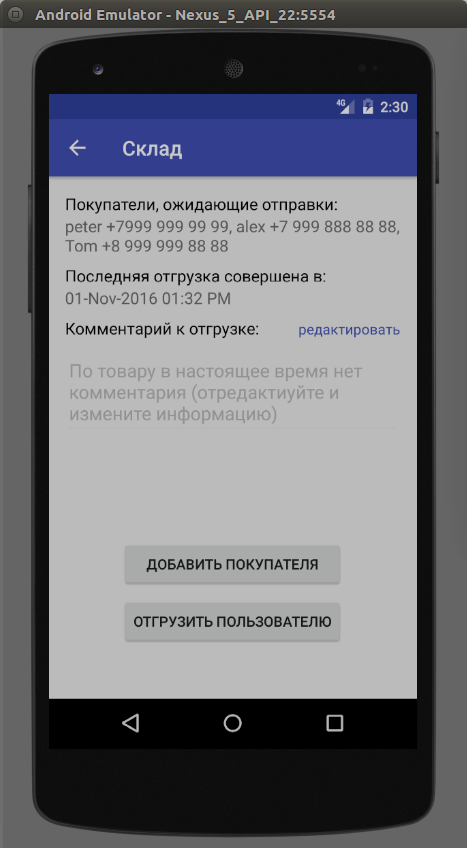

<a name="Storehouse"></a>

# Приложение "Склад"

Данная документация содержит описание демонстрационного приложения "Склад". Исходный код приложения доступен в репозитории <https://github.com/Scorocode/scorocode-sample-storehouse>.

Данное приложение проводит учет мобильных телефонов на складе поставщика и позволяет:

1. Зарегистрировать нового пользователя в БД приложения
2. Провести аутентификацию пользователя приложения
3. Провести деаутентификацию пользователя приложения.
4. Посмотреть доступные модели телефонов на складе
5. Добавить модель телефона в БД
6. Удалить модель телефона из БД
7. Посмотреть подробную информацию о модели телефона
8. Изменить информацию о модели телефона
9. Выбрать интересующие модели из списка используя фильтр
10. Добавить пользователя в лист ожидания данной модели
11. Отгрузить данную модель телефона пользователю
12. Оповестить об отгрузке бухгалтерию при помощи email сообщения
13. Оповестить грузчика при помощи push сообщения.
14. Оповестить курьера при помощи sms сообщения.
15. Провести пересчет баланса фирмы с учетом отгруженных к данному моменту моделей.

## Структура данных приложения:

Создана коллекция `storehouse` со следующими полями:

1. platform (String)
2. cameraInfo (String)
3. deviceName (String)
4. colorsAvailable (Array)
5. devicePrice (Number)
6. buyers (Array)
7. lastSend (Date)
8. sendInfo (File)

В системную коллекцию `Roles` добавлены 3 документа со следующими значениями поля `name` соответственно:

1. deliveryPerson
2. accountantPerson
3. loaderPerson

## Стартовый экран приложения.

Создадим стартовый экран приложения с именем `LoginActivity`. Для этого в Android Studio выберем `File → New → Activity → Empty Activity` и в layout-файл данной активности добавим следующий код:

```xml
<?xml version="1.0" encoding="utf-8"?>
<RelativeLayout xmlns:android="http://schemas.android.com/apk/res/android"
    xmlns:tools="http://schemas.android.com/tools"
    android:id="@+id/activity_login"
    android:layout_width="match_parent"
    android:layout_height="match_parent"
    android:paddingBottom="@dimen/activity_vertical_margin"
    android:paddingLeft="@dimen/activity_horizontal_margin"
    android:paddingRight="@dimen/activity_horizontal_margin"
    android:paddingTop="@dimen/activity_vertical_margin"
    tools:context="prof_itgroup.ru.storehouseapp.Activities.LoginActivity">
    <LinearLayout
        android:layout_width="match_parent"
        android:layout_height="wrap_content"
        android:gravity="center"
        android:orientation="vertical">
        <TextView
            style="@style/label_style"
            android:layout_marginTop="16dp"
            android:text="@string/login" />
        <EditText
            android:id="@+id/etEmail"
            android:gravity="center"
            style="@style/textStyle"
            android:hint="@string/login_hint" />
        <TextView
            style="@style/label_style"
            android:layout_marginTop="16dp"
            android:text="@string/password"/>
        <EditText
            android:gravity="center"
            android:id="@+id/etPassword"
            style="@style/textStyle"
            android:hint="@string/password_hint"
            android:inputType="textPassword"
            android:maxLines="1" />
        <LinearLayout
            android:layout_width="wrap_content"
            android:layout_height="wrap_content"
            android:gravity="center_horizontal"
            android:orientation="vertical">
            <Button
                android:id="@+id/btnLogin"
                android:layout_width="match_parent"
                android:layout_height="wrap_content"
                android:layout_marginTop="4dp"
                android:text="@string/login_button_text" />
            <Button
                android:id="@+id/btnRegister"
                android:layout_width="match_parent"
                android:layout_height="wrap_content"
                android:layout_marginTop="4dp"
                android:text="@string/register_button_text" />
        </LinearLayout>
    </LinearLayout>
</RelativeLayout>
```
Стартовый экран приложения, соответствующий классу `LoginActivity`, показан на рисунке 1.1. 


Рисунок 1.1 – стартовый экран приложения.

В метод `onCreate` класса `LoginActivity` добавим следующий код:

```Java
@Override
protected void onCreate(Bundle savedInstanceState) {
    super.onCreate(savedInstanceState);
    setContentView(R.layout.activity_login);
    if (isUserLogined(this)) {
        MainActivity.display(this);
    }
    ScorocodeSdk.initWith(APPLICATION_ID, CLIENT_KEY, null, FILE_KEY, MESSAGE_KEY, SCRIPT_KEY, null);
    ButterKnife.bind(this);
}
```

В методе `onCreate` данного класса происходит инициализация `ScorocodeSdk` ключами `appId`, `clientKey` (android), `fileKey`, `messageKey`, `scriptKey` при помощи метода `ScorocodeSdk.initWith(...)`; Посмотреть данные ключи можно на вкладке «Безопасность» настроек проекта.

На данном экране пользователь БД может ввести свой логин и пароль и системе. Приложения проведет проверку правильности введенных данных при помощи метода `.login()` класса `User`. Использование данного метода показано в листинге:

```Java
@OnClick(R.id.btnLogin)
public void onBtnLoginClicked() {
    User user = new User();
    user.login(etEmail.getText().toString(), etPassword.getText().toString(), new CallbackLoginUser() {
        @Override
        public void onLoginSucceed(ResponseLogin responseLogin) {
            DocumentInfo userInfo = responseLogin.getResult().getUserInfo();
            saveUserInfo(userInfo);
            MainActivity.display(LoginActivity.this);
        }
        @Override
        public void onLoginFailed(String errorCode, String errorMessage) {
            Helper.showToast(getBaseContext(), R.string.error_login);
        }
    });
}
```

В данном методе мы создаем новый экземпляр класса `User` и вызываем его метод `login` при этом информацию о email и password пользователя мы берем из соответствующих `EditText`. Метод `login` проверит тот факт, что пользователь с таким email и паролем существует в коллекции «users».

В случае если в коллекции «users» имеется пользователь с указанными email и password, то будет выполнен метод `onLoginSucceed(...) callback` интерфейса иначе - `onFoginFailed(...)`. Таким образом мы можем удостовериться в наличии пользователя с такими данными в нашей БД и принять дальнейшие действия.

На стартовом экране (показанном на рисунке 1.1) так же имеется кнопка «Зарегистрировать» позволяющая зарегистрировать нового пользователя в системе (добавить его в коллекцию «users» БД). Привяжем к данной кнопке обработчик нажатия который открывает активность с данными для регистрации пользователя:

```Java
@OnClick(R.id.btnRegister)
public void onBtnRegisterClicked() {
    RegisterActivity.display(this);
}
``` 

## Экран регистрации нового пользователя

Создадим новую активность с именем `RegisterActivity` и добавим в layout-файл данной активности следующий xml код:

```xml
<?xml version="1.0" encoding="utf-8"?>
<LinearLayout xmlns:android="http://schemas.android.com/apk/res/android"
    xmlns:tools="http://schemas.android.com/tools"
    android:id="@+id/activity_register"
    android:layout_width="match_parent"
    android:layout_height="match_parent"
    android:gravity="center_horizontal"
    android:orientation="vertical"
    android:paddingBottom="@dimen/activity_vertical_margin"
    android:paddingLeft="@dimen/activity_horizontal_margin"
    android:paddingRight="@dimen/activity_horizontal_margin"
    android:paddingTop="@dimen/activity_vertical_margin"
    tools:context="prof_itgroup.ru.storehouseapp.Activities.RegisterActivity">
    <TextView
        style="@style/label_style"
        android:text="@string/register_username" />
    <EditText
        android:id="@+id/etUsername"
        style="@style/textStyle"
        android:hint="@string/register_username_hint"/>
    <TextView
        android:layout_marginTop="16dp"
        style="@style/label_style"
        android:text="@string/register_email" />
    <EditText
        android:id="@+id/etEmail"
        style="@style/textStyle"
        android:hint="@string/register_email_hint"/>
    <TextView
        android:layout_marginTop="16dp"
        style="@style/label_style"
        android:text="@string/register_password" />
    <EditText
        android:id="@+id/etPassword"
        style="@style/textStyle"
        android:inputType="textPassword"
        android:hint="@string/register_email_password"/>
    <EditText
        android:id="@+id/etPasswordCheck"
        style="@style/textStyle"
        android:inputType="textPassword"
        android:hint="@string/register_email_password_again"/>
    <Button
        android:layout_marginTop="32dp"
        android:id="@+id/btnRegister"
        style="@style/textStyle"
        android:text="@string/btn_register_text"/>
</LinearLayout>
```
Данная активность представляет собой экран регистрации нового пользователя, показанный на рисунке 1.2


Рисунок 1.2 — экран регистрации нового пользователя.

На данном экране вводятся все необходимые поля документа (характеризующие пользователя). Добавим обработчик нажатия для кнопки «Зарегистрировать» вызывающий метод `.register` класса `User` для регистрации нового пользователя, показанный ниже:

```Java
@OnClick(R.id.btnRegister)
public void onBtnRegisterClicked() {
    String userName = etUsername.getText().toString();
    String email = etEmail.getText().toString();
    String password = etPassword.getText().toString();
    String passwordCheck = etPasswordCheck.getText().toString();

    if(isInputValid(userName, email, password, passwordCheck)) {
        new User().register(userName, email, password, new CallbackRegisterUser() {
            @Override
            public void onRegisterSucceed() {
                Toast.makeText(RegisterActivity.this, getResources().getString(R.string.register_succeed), Toast.LENGTH_SHORT).show();
                LoginActivity.display(RegisterActivity.this);
            }
            @Override
            public void onRegisterFailed(String errorCode, String errorMessage) {
                Toast.makeText(RegisterActivity.this, getResources().getString(R.string.error_register), Toast.LENGTH_SHORT).show();
            }
        });
    } else {
        Toast.makeText(this, getResources().getString(R.string.wrong_data) , Toast.LENGTH_SHORT).show();
    }
}
```

В данном методе мы получаем значения введенные в элементы `EditText`, а именно: имя пользователя, его email, пароль и пароль повторно (для проверки).

Далее при помощи метода isInputValid мы проверяем, что поля не являются пустыми и что значение, введенное в поля пароля и проверки пароля идентичны, после чего вызываем метод `.register` класса `User`.

В случае если регистрация пользователя прошла успешно (т.е если sdk инициализирован, все ключи указаны правильно и нет конфликта с уже существующими пользователями), будет выполнен метод  `onRegisterSucceed(...) callback` интерфейса иначе будет выполнен метод `onRegisterFailed(...)`.

В данном случае при успешной регистрации пользователя выдается Toast-сообщение с информацией о том, что пользователь успешно зарегистрирован и открывается активность `LoginActivity` чтобы пользователь мог аутентифицироваться и приступить к работе с приложением.

## Главный экран приложения.

Создадим главный экран приложения с именем `MainActivity` и в layout-файл данной активности добавим следующий xml код:

```xml
<?xml version="1.0" encoding="utf-8"?>
<RelativeLayout
    xmlns:android="http://schemas.android.com/apk/res/android"
    xmlns:tools="http://schemas.android.com/tools"
    android:id="@+id/activity_main"
    android:layout_width="match_parent"
    android:layout_height="match_parent"
    android:paddingLeft="@dimen/activity_horizontal_margin"
    android:paddingRight="@dimen/activity_horizontal_margin"
    android:paddingTop="@dimen/activity_vertical_margin"
    android:paddingBottom="@dimen/activity_vertical_margin"
    tools:context="prof_itgroup.ru.storehouseapp.Activities.MainActivity">
    <ListView
        android:id="@+id/lvItemsInStorehouse"
        android:layout_width="match_parent"
        android:layout_height="wrap_content"/>
</RelativeLayout>
```

Активность представляет собой `ListView` в который мы передаем информацию о товарах, хранящихся в БД. Кроме того активность содержит иконки `ActionBar` о которых будет сказано подробней.

Для отображения информации создадим адаптер с именем `StoreItemAdapter` код которого показан ниже:

```Java
package prof_itgroup.ru.storehouseapp.Objects;
import android.content.Context;
import android.support.annotation.NonNull;
import android.view.LayoutInflater;
import android.view.View;
import android.view.ViewGroup;
import android.widget.BaseAdapter;
import android.widget.TextView;
import java.util.List;
import butterknife.BindView;
import butterknife.ButterKnife;
import prof_itgroup.ru.storehouseapp.Activities.ItemDetailsActivity;
import prof_itgroup.ru.storehouseapp.R;
import ru.profit_group.scorocode_sdk.scorocode_objects.DocumentInfo;
 
public class StoredItemsAdapter extends BaseAdapter {
    private Context context;
    private List<DocumentInfo> storedItems;
    private int layoutId;
    private LayoutInflater inflater;
    private DocumentFields fields;
    public StoredItemsAdapter(Context context, @NonNull List<DocumentInfo> storedItems, int layoutId) {
        this.context = context;
        this.storedItems = storedItems;
        this.layoutId = layoutId;
        inflater = LayoutInflater.from(context);
        fields = new DocumentFields(context, null);
    }
    @Override
    public int getCount() {
        return storedItems.size();
    }
    @Override
    public Object getItem(int position) {
        return storedItems.get(position);
    }
    @Override
    public long getItemId(int position) {
        return position;
    }
    @Override
    public View getView(int position, View view, ViewGroup parent) {
        ViewHolder holder;
        if (view != null) {
            holder = (ViewHolder) view.getTag();
        } else {
            view = inflater.inflate(layoutId, parent, false);
            holder = new ViewHolder(view);
            view.setTag(holder);
        }
        customizeView(view, holder, storedItems.get(position));
        return view;
    }
    private void customizeView(View view, ViewHolder holder, final DocumentInfo documentInfo) {
        String deviceName = (String) documentInfo.getFields().get(fields.getDeviceNameField());
        String devicePlatform = (String) documentInfo.getFields().get(fields.getPlatformField());
        Double devicePrice = (Double) documentInfo.getFields().get(fields.getDevicePriceField());
        holder.tvStoredItemName.setText(deviceName);
        holder.tvStoredItemStatus.setText(devicePlatform);
        holder.tvStoredItemPrice.setText(String.valueOf(devicePrice));
        view.setOnClickListener(new View.OnClickListener() {
            @Override
            public void onClick(View v) {
                ItemDetailsActivity.display(context, documentInfo);
            }
        });
    }
    static class ViewHolder {
        @BindView(R.id.tvStoredItemName) TextView tvStoredItemName;
        @BindView(R.id.tvStoredItemPlatform) TextView tvStoredItemStatus;
        @BindView(R.id.tvStoredItemPrice) TextView tvStoredItemPrice;
        public ViewHolder(View view) {
            ButterKnife.bind(this, view);
        }
    }
}
```

В качестве элемента списка используем следующий layout-файл:

```xml
 <?xml version="1.0" encoding="utf-8"?>
<RelativeLayout xmlns:android="http://schemas.android.com/apk/res/android"
    android:layout_width="match_parent"
    android:layout_height="match_parent"
    android:orientation="horizontal"
    android:padding="8dp">
    <TextView
        android:id="@+id/tvStoredItemName"
        style="@style/textStyle"
        android:layout_alignParentLeft="true"
        android:layout_toLeftOf="@+id/tvStoredItemPlatform"
        android:text="@string/storedItemName" />
    <TextView
        android:id="@+id/tvStoredItemPlatform"
        style="@style/textStyle"
        android:layout_marginRight="32dp"
        android:layout_toLeftOf="@+id/tvStoredItemPrice"
        android:text="@string/storedItemStatus" />
    <TextView
        android:id="@+id/tvStoredItemPrice"
        style="@style/textStyle"
        android:layout_alignParentRight="true"
        android:text="@string/storedItemPrice" />
</RelativeLayout>
```

Данные о товарах, хранящихся в БД мы будем получать в методе `onResume()` активности `MainActivity`. Для этого в метод `onResume` добавим следующий код:

```Java
@Override
protected void onResume() {
    super.onResume();
    Query query = new Query(COLLECTION_NAME);
    query.findDocuments(new CallbackFindDocument() {
        @Override
        public void onDocumentFound(List<DocumentInfo> documentInfos) {
            if(documentInfos != null) {
                setAdapter(documentInfos);
            }
        }
        @Override
        public void onDocumentNotFound(String errorCode, String errorMessage) {
            Toast.makeText(MainActivity.this, getResources().getString(R.string.error_get_docs), Toast.LENGTH_SHORT).show();
        }
    });
}
```

В данном коде мы создаем экземпляр объекта `Query` не задавая параметров (т.е выбираем первые 100 документов из данной коллекции) и далее с помощью метода findDocument получаем документы из нашей коллекции.

В случае если удалось найти документы мы устанавливаем адаптер, иначе выдаем сообщение об ошибке.

Так же добавим необходимые иконки в `ActionBar` активности. Для этого создадим `layout` файл `main_activity_menu` и добавим туда следующий xml код:

```xml
<menu xmlns:android="http://schemas.android.com/apk/res/android"
    xmlns:app="http://schemas.android.com/apk/res-auto">
    <item
        android:id="@+id/action_add_item"
        android:icon="@drawable/ic_create_new_folder_white_24dp"
        android:title="@string/action_add_item"
        app:showAsAction="always"/>
    <item
        android:id="@+id/action_set_filter"
        android:icon="@drawable/ic_filter_list_white_24dp"
        android:title="@string/action_filter_item"
        app:showAsAction="ifRoom"/>
    <item
        android:id="@+id/action_logout"
        android:icon="@drawable/ic_exit_to_app_white_24dp"
        android:title="@string/action_logout_item"
        app:showAsAction="ifRoom"/>
    
</menu>
```

Т.е в `ActionBar` мы будем отображать иконки «Добавить элемент в БД», «Установить фильтр» и «Завершить активную сессию пользователя» (logout). На экран активности данные иконки добавим при помощи следующего метода:

```Java
@Override
public boolean onCreateOptionsMenu(Menu menu) {
    getMenuInflater().inflate(R.menu.main_activity_menu, menu);
    return super.onCreateOptionsMenu(menu);
}
```

Обрабатывать нажатия на иконки будем при помощи метода показанного ниже

```Java
@Override
public boolean onOptionsItemSelected(MenuItem item) {
    switch (item.getItemId()) {
        case R.id.action_add_item:
            AddItemActivity.display(this);
            break;

        case R.id.action_set_filter:
            new FilterDialog(this).showFilterDialog(new FilterDialog.CallbackFilterDialog() {
                @Override
                public void onFilterApplied(List<DocumentInfo> documentInfo) {
                    setAdapter(documentInfo);
                }
            });
            break;

        case R.id.action_logout:
            LoginActivity.logout(this);
            break;
    }
    return super.onOptionsItemSelected(item);
}
```

Готовый экран данной активности показан на рисунке 2.1


Рисунок 2.1 — главный экран приложения.

На данном экране показаны текущие модели телефонов, присутствующие на складе. В верхнем правом углу экрана показаны следующие иконки:

 - Добавить новую модель в базу данных.


 - Применить фильтр к списку устройств.

	   
 - Закончить активную сессию пользователя (logout).	

При нажатии на кнопку   пользователь переходит на экран добавления устройства в БД.

## Экран добавления устройства

Создадим активность с именем `AddItemActivity` и добавим в её layout-файл следующий xml код:

```xml
<?xml version="1.0" encoding="utf-8"?>
<LinearLayout xmlns:android="http://schemas.android.com/apk/res/android"
    xmlns:tools="http://schemas.android.com/tools"
    android:id="@+id/activity_add_item"
    android:layout_width="match_parent"
    android:layout_height="match_parent"
    android:orientation="vertical"
    android:padding="8dp"
    tools:context="prof_itgroup.ru.storehouseapp.Activities.AddItemActivity">
    <ScrollView
        android:layout_width="match_parent"
        android:layout_height="wrap_content">
        <include layout="@layout/item_core"/>
    </ScrollView>
</LinearLayout>
```

В свою очередь, включаемый файл item_core.xml представляет собой:

```xml
<LinearLayout android:layout_width="match_parent"
    android:layout_height="wrap_content"
    android:orientation="vertical"
    xmlns:android="http://schemas.android.com/apk/res/android">
    <TextView
        style="@style/label_style"
        android:text="@string/add_item_device_name" />
    <EditText
        android:id="@+id/etDeviceName"
        style="@style/textStyle"
        android:hint="@string/add_item_hint_device_name" />
    <TextView
        style="@style/label_style"
        android:text="@string/add_item_device_platform" />
    <EditText
        android:id="@+id/etDevicePlatform"
        style="@style/textStyle"
        android:hint="@string/add_item_hint_device_platform" />
    <TextView
        style="@style/label_style"
        android:text="@string/add_item_camera_info" />
    <EditText
        android:id="@+id/etDeviceCameraInfo"
        style="@style/textStyle"
        android:hint="@string/add_item_hint_camera_info" />
    <TextView
        style="@style/label_style"
        android:text="@string/add_item_available_colors_info" />
    <EditText
        android:id="@+id/etDeviceColors"
        style="@style/textStyle"
        android:hint="@string/add_item_hint_available_colors_info" />
    <LinearLayout
        android:id="@+id/llChangeColorList"
        android:visibility="gone"
        android:gravity="center_horizontal"
        android:orientation="horizontal"
        android:layout_width="match_parent"
        android:layout_height="wrap_content">
        <Button
            android:id="@+id/btnAddColor"
            android:padding="12dp"
            android:layout_marginRight="8dp"
            android:text="@string/add_color"
            android:layout_width="wrap_content"
            android:layout_height="wrap_content" />
        <Button
            android:id="@+id/btnRemoveColor"
            android:padding="12dp"
            android:layout_marginLeft="8dp"
            android:text="@string/remove_color"
            android:layout_width="wrap_content"
            android:layout_height="wrap_content" />
    </LinearLayout>
    <TextView
        style="@style/label_style"
        android:text="@string/add_item_price" />
    <EditText
        android:id="@+id/etDevicePrice"
        style="@style/textStyle"
        android:inputType="number"
        android:hint="@string/add_item_hint_available_amount_info" />
    <LinearLayout
        android:id="@+id/llChangePrice"
        android:visibility="gone"
        android:gravity="center_horizontal"
        android:orientation="horizontal"
        android:layout_width="match_parent"
        android:layout_height="wrap_content">
        <Button
            android:id="@+id/btnIncreaseCount"
            android:padding="8dp"
            android:layout_marginRight="8dp"
            android:text="@string/increase_item_count"
            android:layout_width="wrap_content"
            android:layout_height="wrap_content" />
        <Button
            android:id="@+id/btnDecreaseCount"
            android:padding="8dp"
            android:layout_marginLeft="8dp"
            android:text="@string/decrease_item_count"
            android:layout_width="wrap_content"
            android:layout_height="wrap_content" />
    </LinearLayout>
    <LinearLayout
        android:orientation="vertical"
        android:gravity="center"
        android:layout_gravity="center"
        android:layout_width="200dp"
        android:layout_height="wrap_content"
        android:weightSum="1">
        <Button
            android:id="@+id/btnAddItem"
            android:padding="8dp"
            android:background="#64b5f6"
            android:textColor="@android:color/white"
            android:layout_width="match_parent"
            android:layout_height="wrap_content"
            android:layout_gravity="center_horizontal"
            android:layout_marginTop="8dp"
            android:text="@string/add" />
        <Button
            android:id="@+id/btnClear"
            android:padding="8dp"
            android:background="#64b5f6"
            android:textColor="@android:color/white"
            android:layout_width="match_parent"
            android:layout_height="wrap_content"
            android:layout_gravity="center_horizontal"
            android:layout_marginTop="8dp"
            android:text="@string/button_clear"
            android:layout_weight="0.22" />
    </LinearLayout>
</LinearLayout>
```

Итоговый вид активности показан на рисунке 2.2


Рисунок 2.2 — Экран добавления нового устройства в БД.


На этом экране пользователь вводит всю необходиму информацию о устройстве и нажимает кнопку «ДОБАВИТЬ». При этом программа создает новый документ, заполняет его поля и сохраняет на сервере.  Добавим данные действия: зададим обработчик нажатия кнопки «Добавить» который будет вызывать метод показанный ниже:

```Java
@OnClick(R.id.btnAddItem)
public void onBtnAddItemClicked() {
    Document document = new Document(MainActivity.COLLECTION_NAME);
    if (isAllFieldsFilled()) {
        document.setField(fields.getDeviceNameField(), getStringFrom(etDeviceName).trim());
        document.setField(fields.getPlatformField(), getStringFrom(etDevicePlatform).trim());
        document.setField(fields.getCameraInfoField(), getStringFrom(etDeviceCameraInfo).trim());
        document.setField(fields.getColorsAvailableField(), getColorsListFrom(getStringFrom(etDeviceColors)));
        document.setField(fields.getDevicePriceField(), Double.valueOf(getStringFrom(etDevicePrice)));
        document.saveDocument(new CallbackDocumentSaved() {
            @Override
            public void onDocumentSaved() {
                Toast.makeText(AddItemActivity.this, getString(R.string.succed_add_item), Toast.LENGTH_SHORT).show();
                finish();
            }

            @Override
            public void onDocumentSaveFailed(String errorCode, String errorMessage) {
                Toast.makeText(AddItemActivity.this, getString(R.string.error_add_item), Toast.LENGTH_SHORT).show();
            }
        });
    } else {
        Toast.makeText(this, getString(R.string.wrong_data), Toast.LENGTH_SHORT).show();
    }
}
```

В данном методе мы создаем экземпляр класса `Document`, проверяем заполнил ли пользователь всю информацию в соответствующих `EditText` и устанавливаем поля документа при помощи метода `setField(…)` после чего сохраняем документ. Поскольку документ создан без ассоциации с реальным документом из БД (т.е без использования метода `getDocumentById()`, то новый документ с указанными полями будет загружен на сервер.

Документы хранятся в БД Scorocode в виде показанном на рисунке 2.3


Рисунок 2.3 — храниение документов в коллекции БД Scorocode.

Каждый документ содержит системные и пользовательские поля.
Системными являются:

1. id — уникальный идентификатор документа в коллекции
2. readACL — права на чтения данного документа.
3. updateACL — права на обновление данного документа.
4. removeACL — права на удаление данного документа.
5. createdAt — время создания документа.
6. updatedAt - время последнего обновления документа.

Пользователь может добавлять другие поля по своему усмотрению используя кнопку «Добавить поле» на верхней панели. Пользователь так же может добавить документ нажав кнопку «Добавить документ» на верхней панели и введя значения полей вручную. Более подробно о функциональности верхней панели БД см.документацию Scorocode.

При нажатии на кнопку  пользователь попадает в диалоговое окно фильтра.

Создадим данное диалоговое окно. Для этого создадим класс `FilterDialog` код которого показан ниже:

```Java
package prof_itgroup.ru.storehouseapp.Objects;
import android.content.Context;
import android.content.DialogInterface;
import android.support.v7.app.AlertDialog;
import android.view.LayoutInflater;
import android.view.View;
import android.widget.CheckBox;
import android.widget.EditText;
import java.util.ArrayList;
import java.util.Arrays;
import java.util.List;
import butterknife.ButterKnife;
import prof_itgroup.ru.storehouseapp.Activities.MainActivity;
import prof_itgroup.ru.storehouseapp.Helpers.Helper;
import prof_itgroup.ru.storehouseapp.R;
import ru.profit_group.scorocode_sdk.Callbacks.CallbackFindDocument;
import ru.profit_group.scorocode_sdk.scorocode_objects.DocumentInfo;
import ru.profit_group.scorocode_sdk.scorocode_objects.Query;
 
public class FilterDialog {
    private Context context;
    public FilterDialog(Context context) {
        this.context = context;
    }
    public void showFilterDialog(final CallbackFilterDialog callbackFilterDialog) {
        final View v = LayoutInflater.from(context).inflate(R.layout.filter_layout, null);
        final CheckBox cbPriceFilter = ButterKnife.findById(v, R.id.cbPriceFilter);
        final CheckBox cbPlatformFilter = ButterKnife.findById(v, R.id.cbPlatformFilter);
        final CheckBox cbColourFilter = ButterKnife.findById(v, R.id.cbColorFilter);
        final EditText etPlatformFilter = ButterKnife.findById(v, R.id.etPlatformFilter);
        final EditText etColors = ButterKnife.findById(v, R.id.etColors);
        AlertDialog.Builder builder = new AlertDialog.Builder(context)
                .setTitle(R.string.titleChooseFilterProperties)
                .setPositiveButton(R.string.continue_action, new DialogInterface.OnClickListener() {
                    @Override
                    public void onClick(DialogInterface dialog, int which) {
                        Query query = new Query(MainActivity.COLLECTION_NAME);
                        if (cbPriceFilter.isChecked()) {
                            setPriceFilter(v, query);
                        }
                        if (cbPlatformFilter.isChecked()) {
                            query.equalTo(new DocumentFields(context).getPlatformField(), etPlatformFilter.getText().toString());
                        }
                        if(cbColourFilter.isChecked()) {
                            List<Object> colors = new ArrayList<>();
                            colors.addAll(Arrays.asList(Helper.getStringFrom(etColors).split(",")));
                            query.containedIn(new DocumentFields(context).getColorsAvailableField(), colors);
                        }
                        query.findDocuments(new CallbackFindDocument() {
                            @Override
                            public void onDocumentFound(List<DocumentInfo> documentInfos) {
                                 callbackFilterDialog.onFilterApplied(documentInfos);
                            }
                            @Override
                            public void onDocumentNotFound(String errorCode, String errorMessage) {
                                Helper.showToast(context, R.string.error);
                            }
                        });
                    }
                }).setView(v);
        builder.show();
    }
    private void setPriceFilter(View view, Query query) {
        String priceField = new DocumentFields(view.getContext()).getDevicePriceField();
        final CheckBox cbIncludeLower = ButterKnife.findById(view, R.id.cbIncludeLower);
        final CheckBox cbIncludeUpper = ButterKnife.findById(view, R.id.cbIncludeUpper);
        final EditText etLowerPrice = ButterKnife.findById(view, R.id.etPriceFrom);
        final EditText etUpperPrice = ButterKnife.findById(view, R.id.etPriceTo);
        if(cbIncludeLower.isChecked()) {
            query.greaterThenOrEqualTo(priceField, getPrice(etLowerPrice));
        } else {
            query.greaterThan(priceField, getPrice(etLowerPrice));
        }
        if(cbIncludeUpper.isChecked()) {
            query.lessThanOrEqualTo(priceField, getPrice(etUpperPrice));
        } else {
            query.lessThan(priceField, getPrice(etUpperPrice));
        }
    }
    private Double getPrice(EditText etPrice) {
        String price = etPrice.getText().toString();
        Double priceDouble = 0d;
        if(!price.isEmpty()) {
            priceDouble = Double.valueOf(price);
        }
        return priceDouble;
    }
    public interface CallbackFilterDialog {
        void onFilterApplied(List<DocumentInfo> documentInfo);
    }
}
```

В методе `showFilterDialog` мы создаем `AlertDialog` и задаем ему `View` из следующего layout-файла:

```xml
 <?xml version="1.0" encoding="utf-8"?>
<LinearLayout xmlns:android="http://schemas.android.com/apk/res/android"
    android:orientation="vertical"
    android:padding="16dp"
    android:layout_width="match_parent"
    android:layout_height="match_parent">
    <include layout="@layout/price_filter_layout" />

    <include layout="@layout/dilimeter" />

    <include layout="@layout/platform_filter" />

    <include layout="@layout/dilimeter" />

    <LinearLayout
        android:orientation="horizontal"
        android:layout_width="match_parent"
        android:layout_height="wrap_content">
        <CheckBox
            android:id="@+id/cbColorFilter"
            android:layout_width="wrap_content"
            android:layout_height="wrap_content" />
        <TextView
            android:text="@string/colorsFilter"
            style="@style/label_style"/>
        <EditText
            android:id="@+id/etColors"
            android:layout_marginLeft="16dp"
            android:hint="@string/color_filter_hint"
            style="@style/label_style" />
    </LinearLayout>
</LinearLayout>
```

Включаемые layout-файлы `price_filter_layout` и `platform_filter` показаны ниже:

```xml
<?xml version="1.0" encoding="utf-8"?>
<LinearLayout xmlns:android="http://schemas.android.com/apk/res/android"
    xmlns:tools="http://schemas.android.com/tools"
    android:orientation="vertical"
    android:layout_width="match_parent"
    android:layout_height="wrap_content"
    tools:showIn="@layout/filter_layout">
    <LinearLayout
        android:orientation="horizontal"
        android:layout_width="match_parent"
        android:layout_height="wrap_content">
        <CheckBox
            android:id="@+id/cbPriceFilter"
            android:layout_width="wrap_content"
            android:layout_height="wrap_content" />
        <TextView
            android:layout_marginLeft="8dp"
            android:layout_marginStart="8dp"
            android:text="@string/filter_price_from"
            style="@style/label_style" />
        <EditText
            android:id="@+id/etPriceFrom"
            android:layout_marginLeft="4dp"
            android:layout_marginStart="4dp"
            android:minWidth="60dp"
            android:layout_width="wrap_content"
            android:layout_height="wrap_content" />
        <TextView
            android:text="@string/filter_price_up_to"
            android:layout_width="wrap_content"
            android:layout_height="wrap_content" />
        <EditText
            android:id="@+id/etPriceTo"
            android:layout_marginLeft="4dp"
            android:layout_marginStart="4dp"
            android:minWidth="60dp"
            style="@style/label_style"/>
    </LinearLayout>
    <RelativeLayout
        android:layout_width="match_parent"
        android:layout_height="wrap_content">
        <LinearLayout
            android:id="@+id/llLowerBound"
            android:layout_marginLeft="32dp"
            android:layout_alignParentLeft="true"
            android:orientation="horizontal"
            android:layout_width="wrap_content"
            android:layout_height="wrap_content">
            <CheckBox
                android:id="@+id/cbIncludeLower"
                android:layout_width="wrap_content"
                android:layout_height="wrap_content" />
            <TextView
                android:layout_gravity="fill"
                android:text="@string/include_lower"
                style="@style/label_style" />
        </LinearLayout>
        <LinearLayout
            android:layout_marginLeft="160dp"
            android:orientation="horizontal"
            android:layout_width="wrap_content"
            android:layout_height="wrap_content">
            <CheckBox
                android:id="@+id/cbIncludeUpper"
                android:layout_width="wrap_content"
                android:layout_height="wrap_content" />
            <TextView
                android:layout_gravity="fill"
                android:text="@string/include_upper"
                style="@style/label_style" />
        </LinearLayout>
    </RelativeLayout>
</LinearLayout>
```

```xml
<?xml version="1.0" encoding="utf-8"?>
<LinearLayout xmlns:android="http://schemas.android.com/apk/res/android"
    xmlns:tools="http://schemas.android.com/tools"
    android:orientation="horizontal"
    android:layout_width="wrap_content"
    android:layout_height="wrap_content"
    tools:showIn="@layout/filter_layout">
    <CheckBox
        android:id="@+id/cbPlatformFilter"
        android:layout_width="wrap_content"
        android:layout_height="wrap_content" />
    <TextView
        android:layout_marginLeft="8dp"
        android:layout_marginStart="8dp"
        android:text="@string/filter_platform"
        style="@style/label_style" />
    <EditText
        android:id="@+id/etPlatformFilter"
        android:layout_marginLeft="4dp"
        android:layout_marginStart="4dp"
        android:minWidth="60dp"
        android:layout_width="wrap_content"
        android:layout_height="wrap_content" />
</LinearLayout>
```

Диалоговое окно фильтра показано на рисунке 2.4


Рисунок 2.4 — диалоговое окно фильтра.

В данном диалоговом окне пользователь может задать условия выборки из БД по определенным критериям, а именно:
* Цена устройства
* Платформа устройства (Android или iOS, а так же номер версии ОС).
* Доступные в наличии цвета.

При нажатии на кнопку «Продолжить» мы проверяем выбраны ли элементы CheckBox и если да — ставим соответствующий фильтр.

Листинг кода для задания фильтра:  

```Java
public void showFilterDialog(final CallbackFilterDialog callbackFilterDialog) {
    final View v = LayoutInflater.from(context).inflate(R.layout.filter_layout, null);
    final CheckBox cbPriceFilter = ButterKnife.findById(v, R.id.cbPriceFilter);
    final CheckBox cbPlatformFilter = ButterKnife.findById(v, R.id.cbPlatformFilter);
    final CheckBox cbColourFilter = ButterKnife.findById(v, R.id.cbColorFilter);
    final EditText etPlatformFilter = ButterKnife.findById(v, R.id.etPlatformFilter);
    final EditText etColors = ButterKnife.findById(v, R.id.etColors);
    
    AlertDialog.Builder builder = new AlertDialog.Builder(context)
            .setTitle(R.string.titleChooseFilterProperties)
            .setPositiveButton(R.string.continue_action, new DialogInterface.OnClickListener() {
                @Override
                public void onClick(DialogInterface dialog, int which) {
                    Query query = new Query(MainActivity.COLLECTION_NAME);
                    if (cbPriceFilter.isChecked()) {
                        setPriceFilter(v, query);
                    }
    
                    if (cbPlatformFilter.isChecked()) {
                        query.equalTo(new DocumentFields(context).getPlatformField(), etPlatformFilter.getText().toString());
                    }
    
                    if(cbColourFilter.isChecked()) {
                        List<Object> colors = new ArrayList<>();
                        colors.addAll(Arrays.asList(Helper.getStringFrom(etColors).split(",")));
                        query.containedIn(new DocumentFields(context).getColorsAvailableField(), colors);
                    }
                    query.findDocuments(new CallbackFindDocument() {
                        @Override
                        public void onDocumentFound(List<DocumentInfo> documentInfos) {
                             callbackFilterDialog.onFilterApplied(documentInfos);
                        }
                        @Override
                        public void onDocumentNotFound(String errorCode, String errorMessage) {
                            Helper.showToast(context, R.string.error);
                        }
                    });
                }
            }).setView(v);
    builder.show();
}

private void setPriceFilter(View view, Query query) {
    String priceField = new DocumentFields(view.getContext()).getDevicePriceField();
    final CheckBox cbIncludeLower = ButterKnife.findById(view, R.id.cbIncludeLower);
    final CheckBox cbIncludeUpper = ButterKnife.findById(view, R.id.cbIncludeUpper);
    final EditText etLowerPrice = ButterKnife.findById(view, R.id.etPriceFrom);
    final EditText etUpperPrice = ButterKnife.findById(view, R.id.etPriceTo);
    if(cbIncludeLower.isChecked()) {
        query.greaterThenOrEqualTo(priceField, getPrice(etLowerPrice));
    } else {
        query.greaterThan(priceField, getPrice(etLowerPrice));
    }
    if(cbIncludeUpper.isChecked()) {
        query.lessThanOrEqualTo(priceField, getPrice(etUpperPrice));
    } else {
        query.lessThan(priceField, getPrice(etUpperPrice));
    }
}
```

Фильтр задается следующим образом: мы создаем объект `Query`, выборку мы ведем из нашей коллекции. Далее: если выбран фильтр цены (установлена соответствующая галочка), то мы выбираем из БД только устройства для которых цена попадает в пределы указанных границ.

Границы цен задаются при помощи следующих методов:
* greaterThan задает нижнюю границу цены (не включая указанную цену).
* lessThan задает верхнюю границу цены (не включая указанную цену).
* greaterThanOrEqualTo задает нижнюю границу цены включая указанную цену.
* lessThanOrEqualTo задает верхнюю границу цены включая указанную цену.

Поиск по платформе задается при помощи метода `equalTo(field, value)` класса `Query` который указывает экземпляру данного класса оставить в выборке только документы у которых значение поля указанного в параметре `field` совпадает с `value`. В нашем случае мы можем например найти все Android 7.0 девайсы, указав `query.equalTo(«platform», «Android 7.0»);`

Поиск по доступным цветам задается при помощи метода `containedIn` класса `Query` который оставляет в выборке только те документы для которых поле (типа массив) содержит все элементы заданного массива.

Таким образом мы формируем запрос (query) для указанной коллекции БД и получаем экземпляры класса `DocumentInfo` характеризующие документы, удовлетворяющие данному запросу. Эту информацию мы передаем в активность при помощи callback и обновляем информацию.

При нажатии на кнопку  происходит завершение активной сессии пользователя (logout) и пользователь попадает обратно на стартовый экран приложения.

Для осуществления данной функциональности нужно задать обработчик нажатия для данной кнопки, вызывающий метод  `logout` класса `User` для завершения активной сессии пользователя:

```Java
public static void logout(final Context context) {
    LocalPersistence.writeObjectToFile(context, null, LocalPersistence.FILE_USER_INFO);
    new User().logout(new CallbackLogoutUser() {
        @Override
        public void onLogoutSucceed() {
            display(context);
        }

        @Override
        public void onLogoutFailed(String errorCode, String errorMessage) {
            Helper.showToast(context, R.string.error);
        }
    });
}
```
В данном методе сначала удаляется файл с информацией о пользователе (данный файл хранится локально и используется для проверки того факта, что пользователь прошел идентификацию в приложении) затем используется метод `logout(…)` класса `User`, который завершает активную сессию пользователя.

В случае успешного завершения активной сессии пользователя будет вызван метод `onLogoutSucceed(...) callback` интерфейса, иначе будет вызван метод `onLogoutFailed(...)`.

## Экран подробной информации о устройстве.

При нажатии на любой из элементов списка устройств главного экрана приложения пользователь попадает на экран подробной информации об устройстве.

Создадим активность с именем `ItemDetailsInfo` и в layout-файл данной активности добавим следующий xml код:

```xml
<?xml version="1.0" encoding="utf-8"?>
<LinearLayout xmlns:android="http://schemas.android.com/apk/res/android"
    xmlns:tools="http://schemas.android.com/tools"
    android:id="@+id/activity_detailed_item_info"
    android:layout_width="match_parent"
    android:layout_height="match_parent"
    android:padding="16dp"
    android:orientation="vertical"
    tools:context="prof_itgroup.ru.storehouseapp.Activities.ItemDetailsActivity">
    <ScrollView
        android:layout_width="match_parent"
        android:layout_height="wrap_content">
            <include layout="@layout/item_core"/>
    </ScrollView>
</LinearLayout>
```

Как видно layout-файл активности переиспользует xml код экрана добавления элемента в БД, но на данном экране так же присутствует возможность перейти в режим редактирования, т.е актививровать скрытые `View` экрана.

В `ActionBar` данного экрана так же добавим иконки для редактирования записи об устройстве (документа), удаления записи об устройстве (документа) и перехода на экран информации об отгрузке.

Для задания иконок в `ActionBar` создадим layout-файл с именем `detailed_info_menu` и добавим в него следующий код:

```xml
<menu xmlns:android="http://schemas.android.com/apk/res/android"
    xmlns:app="http://schemas.android.com/apk/res-auto">
    <item
        android:id="@+id/action_edit_item"
        android:title="@string/action_edit_item"
        android:icon="@drawable/ic_mode_edit_white_24dp"
        app:showAsAction="always"/>
   
    <item
        android:id="@+id/action_remove_item"
        android:title="@string/action_remove_item"
        android:icon="@drawable/ic_delete_forever_white_24dp"
        app:showAsAction="ifRoom"/>
   
     <item
        android:id="@+id/action_prepare_item"
        android:icon="@drawable/ic_assignment_white_24dp"
        android:title="@string/action_prepare_item"
        app:showAsAction="ifRoom"/>
</menu>
```

В самой активности добавим метод:

```Java
@Override
public boolean onCreateOptionsMenu(Menu menu) {
    getMenuInflater().inflate(R.menu.detailed_info_menu, menu);
    return super.onCreateOptionsMenu(menu);
}
```

который установит иконки в `ActionBar`.

Обрабатывать нажатие на иконки мы будем при помощи метода указанного ниже:

```Java
@Override
public boolean onOptionsItemSelected(MenuItem item) {
    switch (item.getItemId()) {
        case android.R.id.home:
            finish();
            break;
        case R.id.action_edit_item:
            setEditMode(true);
            break;
        case R.id.action_remove_item:
            DocumentHelper.fetchAndRemoveDocument(this, document, getDocumentInfo());
            break;
        case R.id.action_prepare_item:
            SendItemActivity.display(this, getDocumentInfo());
            break;
    }
    return super.onOptionsItemSelected(item);
}
``` 

В результате получим экран показанный на рисунке 3.1


Рисунок 3.1 — экран подробной информации об устройстве.

В верхней правой части экрана присутствуют следующие иконки:

 Редактировать информацию о устройстве


 Удалить данное устройство из БД


 Перейти к информации об отгрузке данного товара.


При нажатии на кнопку  экран переключается в режим редактирования. Для этого сделаем видимыми кнопки «Добавить цвет», «Удалить цвет», «Увеличить цену на складе», «Уменьшить цену на складе». Экран подробной информации о устройстве в режиме редактирования показан на рисунке 3.2


Рисунок 3.2 — Экран подробной информации об устройстве в режиме редактирования

Зададим обработчик нажатия кнопки «Изменить запись», который будет вызывать следующий метод:

```Java
private void updateItemDocument() {
    document.getDocumentById(getDocumentInfo().getId(), new CallbackGetDocumentById() {
        @Override
        public void onDocumentFound(DocumentInfo documentInfo) {
            document.updateDocument()
                    .set(fields.getDeviceNameField(), getStringFrom(etDeviceName))
                    .set(fields.getPlatformField(), getStringFrom(etDevicePlatform))
                    .set(fields.getCameraInfoField(), getStringFrom(etDeviceCameraInfo));
            setColorsUpdateInfo();
            document.updateDocument().inc(fields.getDevicePriceField(), increaseCount);
            document.saveDocument(new CallbackDocumentSaved() {
                @Override
                public void onDocumentSaved() {
                    setEditMode(false);
                    for (String color : deviceColors.keySet()) {
                        deviceColors.put(color, ColorState.FROM_DB);
                    }
                    document.updateDocument().getUpdateInfo().clear();
                }
                @Override
                public void onDocumentSaveFailed(String errorCode, String errorMessage) {
                    showToast(R.string.error_update_item);
                    setFields();
                }
            });
        }
        @Override
        public void onDocumentNotFound(String errorCode, String errorMessage) {
            showToast(R.string.error_update_item);
            setFields();
        }
    });
}
private void setColorsUpdateInfo() {
    for (String color : deviceColors.keySet()) {
        ColorState colorState = deviceColors.get(color);
        switch (colorState) {
            case TO_REMOVE:
                document.updateDocument().pull(fields.getColorsAvailableField(), color);
                break;

            case NEW:
                document.updateDocument().push(fields.getColorsAvailableField(), color);
                break;
        }
    }
}
```

Для обновления информации об устройстве используется метод `updateDocument()` класса `Document`. При этом экземпляр класса Document обновление которого мы проводим должен быть ассоциирован с реальным документом из БД при помощи метода `getDocumentById`. При этом новые значения следующих полей:

* Название устройства (поле deviceName в БД)
* ОС устройства (поле platform в БД)
* Информация о камере (deviceCameraInfo)

задаются при помощи метода `set(field, value)` класса `Update`.

Поле «цена устройства» (поле devicePrice в БД) задается при помощи метода `.inc(field, value)` класса `Update`. При этом если мы увеличиваем цену, то используем в положительные значения параметра value, если уменьшаем, то отрицательную.

Поле «доступные цвета» (поле colorsAvailable в БД) задается при помощи методов `.push()` (для добавления цвета устройства) и `.pull()` (для удаления цвета устройства).

Рассмотрим еще раз работу метода `updateItemDocument(...)`: для обновления полей документа нам нужно удостовериться, что такой документ существует и ассоциировать наш экземпляр класса `Document` с документом в БД. Для этого мы используем метод `.getDocumentById(…)` класса `Document`.
После того как мы ассоциировали наш документ с документом из БД мы получаем объект класса `Update` при помощи метода `.updateDocument()`. Далее используя объект класса Update мы задаем название, платформу и информацию о камере устройства при помощи метода `.set(…)`, добавляем в массив (при помощи метода `.push()`) или удаляем из массива (при помощи метода `.pull`) доступные цвета для данного устройства и изменяем цену (при помощи метода `.inc()`) в поле цены. После задания всех необходимых изменений в экземпляре класса `Update` мы производим сохранение документа при помощи метода `.saveDocument(…)` класса `Document`.

Поскольку документ получен путем ассоциации с документом из БД (при помощи метода `.getDocumentById`), то в результате выполнения `.saveDocument(…)` произойдет обновление документа, а не создание нового документа.

Рассмотрим действие кнопки  - при нажатии на данную кнопку происходит удаление информации об устройстве из БД. Для этого добавим обработчик нажатия данной кнопки вызывающий метод показанный ниже:

```Java
public static void fetchAndRemoveDocument(final Context context, final Document document, DocumentInfo documentInfo) {
    document.getDocumentById(documentInfo.getId(), new CallbackGetDocumentById() {
        @Override
        public void onDocumentFound(DocumentInfo documentInfo) {
            removeDocument(context, document);
        }
        @Override
        public void onDocumentNotFound(String errorCode, String errorMessage) {
            Helper.showToast(context, R.string.error_document_not_removed);
        }
    });
}
public static void removeDocument(final Context context, Document document) {
        document.removeDocument(new CallbackRemoveDocument() {
            @Override
            public void onRemoveSucceed(ResponseRemove responseRemove) {
                Toast.makeText(context, context.getString(R.string.document_removed), Toast.LENGTH_SHORT).show();
                ((Activity) context).finish();
            }
            @Override
            public void onRemoveFailed(String errorCode, String errorMessage) {
                Toast.makeText(context, context.getString(R.string.error_document_not_removed), Toast.LENGTH_SHORT).show();
            }
        });
}
```

Рассмотрим данный метод подробней:
Сначала мы используем метод `.getDocumentById(...)` класса `Document` для того чтобы удостовериться, что такой документ существует и провести ассоциацию данного документа с созданным нами экземпляром класса `Document`.

После того как мы удостоверились в наличии данного документа мы вызываем метод `.removeDocument()` класса `Document` который удаляет документ из БД.

Рассмотрим действие кнопки . При нажатии на эту кнопку мы переходим к экрану с информацией об отгрузке товара. 

## Экран информации об отгрузке товара.

Создадим новую активность с именем `SendItemActivity` и добавим в layout-файл данной активности следующий xml код:

```xml
<?xml version="1.0" encoding="utf-8"?>
<LinearLayout xmlns:android="http://schemas.android.com/apk/res/android"
    xmlns:tools="http://schemas.android.com/tools"
    android:id="@+id/activity_send_item"
    android:layout_width="match_parent"
    android:layout_height="match_parent"
    android:padding="16dp"
    android:orientation="vertical"
    tools:context="prof_itgroup.ru.storehouseapp.Activities.SendItemActivity">
    <LinearLayout
        android:id="@+id/llWaitingUsers"
        android:orientation="vertical"
        android:layout_width="match_parent"
        android:layout_height="wrap_content">
        <TextView
            style="@style/label_style"
            android:textColor="@android:color/black"
            android:text="@string/action_waiting_list"/>
        <TextView
            android:id="@+id/tvWaitingUsers"
            style="@style/label_style"/>
        <TextView
            android:id="@+id/tvLastChangeLabel"
            android:textColor="@android:color/black"
            android:layout_marginTop="8dp"
            style="@style/label_style"
            android:text="@string/last_change"/>
        <TextView
            android:id="@+id/tvLastChange"
            style="@style/label_style"/>
        <LinearLayout
            android:id="@+id/llInfoContainer"
            android:orientation="vertical"
            android:layout_width="match_parent"
            android:layout_height="wrap_content">
            <RelativeLayout
                android:layout_width="match_parent"
                android:layout_height="wrap_content">
                <TextView
                    android:layout_marginTop="8dp"
                    android:textColor="@android:color/black"
                    android:text="@string/item_info"
                    style="@style/label_style" />
                <TextView
                    android:id="@+id/tvEdit"
                    android:layout_alignParentRight="true"
                    android:layout_marginTop="10dp"
                    android:text="@string/editInfo"
                    android:textColor="@color/colorPrimary"
                    android:layout_width="wrap_content"
                    android:layout_height="wrap_content" />
            </RelativeLayout>
            <ScrollView
                android:layout_marginTop="8dp"
                android:layout_width="wrap_content"
                android:layout_height="180dp">
                <EditText
                    android:id="@+id/etItemInfo"
                    android:enabled="false"
                    android:layout_width="wrap_content"
                    android:layout_height="180dp" />
            </ScrollView>
        </LinearLayout>
    </LinearLayout>
    <LinearLayout
        android:orientation="vertical"
        android:layout_gravity="center_horizontal"
        android:layout_width="wrap_content"
        android:layout_height="wrap_content">
        <Button
            android:layout_marginTop="8dp"
            android:layout_gravity="center_horizontal"
            android:id="@+id/btnAppUserInList"
            android:text="@string/addUserInList"
            android:layout_width="match_parent"
            android:layout_height="wrap_content" />
        <Button
            android:layout_marginTop="8dp"
            android:layout_gravity="center_horizontal"
            android:id="@+id/btnSendToUser"
            android:text="@string/sendToUser"
            android:layout_width="match_parent"
            android:layout_height="wrap_content" />
    </LinearLayout>
</LinearLayout>
```

Полученный экран показан на рисунке  4.1



Рисунок 4.1 — экран с информацией об отгрузке товара

При нажатии на кнопку «ДОБАВИТЬ ПОКУПАТЕЛЯ» вызывается диалоговое окно с просьбой ввести информацию о покупателе после чего вызывается метод:

```Java
private void addBuyerAndRefreshWaitingList(final String buyerInfo) {
    if(!buyerInfo.trim().isEmpty()) {
        document.getDocumentById(getDocumentInfo().getId(), new CallbackGetDocumentById() {
            @Override
            public void onDocumentFound(DocumentInfo documentInfo) {
                document.updateDocument().push(fields.getBuyersField(), buyerInfo);
                document.saveDocument(new CallbackDocumentSaved() {
                    @Override
                    public void onDocumentSaved() {
                        document.updateDocument().getUpdateInfo().clear();
                        refreshWaitingList();
                        showToast(getBaseContext(), R.string.add_waiting_buyer);
                    }
                    @Override
                    public void onDocumentSaveFailed(String errorCode, String errorMessage) {
                        showToast(getBaseContext(), R.string.error);
                    }
                });
            }
            @Override
            public void onDocumentNotFound(String errorCode, String errorMessage) {
                showToast(getBaseContext(), R.string.error);
            }
        });
    }
}
```

Рассмотрим метод более подробно. Сначала проверяем, что введенное поле с именем клиента не является пустым. В случае если пользователь ввел данные происходит ассоциация экземпляра класса Document с документом в БД после чего происходит обновление информации документа следующем образом: веденная пользователем информация о покупателе добавляется в конец массива покупателей с помощью метода `.push()` класса `Update`. Таким образом формируется очередь покупателей, ожидающих отправки товара.

При нажатии на кнопку «ОТГРУЗИТЬ ПОЛЬЗОВАТЕЛЮ» из массива ожидающих отправки клиентов должен удаляться первый клиент, должно сохраняться время последней отправки и сотрудники (грузчики, курьеры, бухгалтерия) должны быть оповещены об этом.  
Для этого добавим обработчик для данной кнопки, который вызывает метод показанный ниже:

```Java
@OnClick(R.id.btnSendToUser)
public void onSendToUserButtonClicked() {
    document.getDocumentById(getDocumentInfo().getId(), new CallbackGetDocumentById() {
        @Override
        public void onDocumentFound(final DocumentInfo documentInfo) {
            document.updateDocument()
                    .popFirst(fields.getBuyersField())
                    .setCurrentDate(fields.getLastSendField());
   
         document.saveDocument(new CallbackDocumentSaved() {
                @Override
                public void onDocumentSaved() {
                    document.updateDocument().getUpdateInfo().clear();
                    new ItemNotificator(getBaseContext(), documentInfo.getId(), fields.getDeviceName()).notifyPersonalAboutItemSend();
                    new BalanceNotificator(getBaseContext()).refreshCompanyBalance();
                    etItemInfo.setVisibility(View.VISIBLE);
                    etItemInfo.append(fields.getLastSendTime());
                    refreshWaitingList();
                }
   
               @Override
                public void onDocumentSaveFailed(String errorCode, String errorMessage) {
                    showToast(getBaseContext(), R.string.error);
                }
            });
 }
```

В данном методе происходит ассоциация экземпляра класса `Document` с документом из БД при помощи метода `.getDocumentById()` класса `Document`, после чего получается экземпляр класса `Update` и используется его метод `.popFirst` который удаляет первый элемент массива (имитируя обслуживание первого человека в очереди). Кроме того в поле «Последняя отгрузка совершена в» (поле lastSend в БД) записывается время последней отгрузки при помощи метода `.setCurrentDate(…)` класса `Update`.

Так же на этом экране присутствует комментарий к отгрузке товара, который хранится в файле документа (поле sendInfo типа File). По умолчанию этот файл отсутствует и в текстовое окно выдается информацию по умолчанию «По товару в настоящее время нет комментария ...». Пользователь может нажать кнопку «редактировать», изменить комментарий к отгрузке и нажать «сохранить». При этом будет вызван метод:

```Java
public static void uploadFile(final Context context, Document document, String content) {
    document.uploadFile(new DocumentFields(context).getSendInfoField(), FILE_NAME, encode(content.getBytes()),
        new CallbackUploadFile() {
        @Override
        public void onDocumentUploaded() {
		//file loaded
	    }

        @Override
        public void onDocumentUploadFailed(String errorCode, String errorMessage) {
            Helper.showToast(context, R.string.error);
        }
    });
}
```

Данный метод загружает файл в поле (типа File) документа БД. Документ при этом должен быть ассоциирован при помощи метода `getDocumentById(…)`. Аналогичным образом происходит удаление документа из БД.

Информация о пользователях, ожидающих отгрузки и комментарии загружаются с сервера при помощи метода показанного ниже.

```Java
private void refreshWaitingList() {
    document.getDocumentById(getDocumentInfo().getId(), new CallbackGetDocumentById() {
        @Override
        public void onDocumentFound(DocumentInfo documentInfo) {
            fields.setDocumentInfo(documentInfo);
            tvWaitingUsers.setText(fields.getBuyers());
            tvLastChange.setText(fields.getLastSendTime());
            llWaitingUsers.setVisibility(fields.getBuyers().isEmpty() ? View.GONE : View.VISIBLE);
            tvLastChangeLabel.setVisibility(fields.getLastSendTime().isEmpty() ? View.GONE : View.VISIBLE);
            tvLastChange.setVisibility(fields.getLastSendTime().isEmpty() ? View.GONE : View.VISIBLE);
            btnSendToUser.setVisibility(fields.getBuyers().isEmpty() ? View.GONE : View.VISIBLE);
            document.getFileContent(fields.getSendInfoField(), FileHelper.FILE_NAME, new CallbackGetFile() {
                @Override
                public void onSucceed(String fileContent) {
                    if(fileContent != null && !fileContent.trim().isEmpty()) {
                        etItemInfo.setText(fileContent);
                    } else {
                        etItemInfo.setText(R.string.no_info);
                    }
                }
                @Override
                public void onFailed(String errorCode, String errorMessage) {
                    showToast(getBaseContext(), R.string.error);
                }
            });
        }
        @Override
        public void onDocumentNotFound(String errorCode, String errorMessage) {
            tvWaitingUsers.setVisibility(View.GONE);
        }
    });
}
```

В данном методе происходит ассоциация экземпляра класса `Document` с документом из БД после чего на экране обновляются значения следующих полей:
1. список ожидающих пользователей
2. время последней отгрузки
3. устанавливается видимость тех или иных элементов в зависимости от контента.
4. При помощи метода getFileContent класса Document получаем содержимое файла в виде строки (с сохранением форматирования). Полученную строку устанавливаем в поле комментария.

Так же создадим класс  ItemNotificator и добавим в него метод notifyPersonalAboutItemSend()
который будем вызывать при отгрузке товара пользователю. Код метода показан ниже
public void notifyPersonalAboutItemSend() {
    sendPushToLoaderPerson();
    sendEmailInAccountingDepartment();
    sendSmsToDeliveryPerson();
}
 
Данный метод проводит уведомление персонала о том, что товар подготовлен к отправке следующим образом:

- отсылает push сообщение грузчику при помощи метода:

```Java
private void sendPushToLoaderPerson() {
    Query query = new Query("roles");
    query.equalTo("name", "loaderPerson");
    query.equalTo("isFree", true);
    query.setLimit(1);

    MessagePush messagePush = new MessagePush(context.getString(R.string.you_should_take) + getItemInfo() + context.getString(R.string.and_prepare), null);
    message.sendPush(messagePush, query, new CallbackSendPush() {
        @Override
        public void onPushSended() {
            Helper.showToast(context, R.string.push_sended);
        }
        @Override
        public void onPushSendFailed(String errorCode, String errorMessage) {
            Helper.showToast(context, R.string.cant_send_push);
        }
    });
}
```

- отсылает sms сообщение курьеру

```Java
private void sendSmsToDeliveryPerson() {
    Query query = new Query("roles");
    query.equalTo("name", "deliveryPerson");
    query.equalTo("isFree", true);
    query.setLimit(1);

    MessageSms messageSms = new MessageSms(context.getString(R.string.take_item) + getItemInfo());
    message.sendSms(messageSms, query, new CallbackSendSms() {
        @Override
        public void onSmsSended() {
            Helper.showToast(context, R.string.sms_was_sended);
        }

        @Override
        public void onSmsSendFailed(String errorCode, String errorMessage) {
            Helper.showToast(context, R.string.cant_send_sms);
        }
    });
}
```

- отсылает email в бухгалтерию.

```Java
private void sendEmailInAccountingDepartment() {
    Query query = new Query("roles");
    query.equalTo("name", "accountantPerson");

    MessageEmail messageEmail = new MessageEmail(context.getString(R.string.from), context.getString(R.string.device) + getItemInfo() , context.getString(R.string.device) + getItemInfo() + context.getString(R.string.sold));
    message.sendEmail(messageEmail, query, new CallbackSendEmail() {
        @Override
        public void onEmailSend() {
            Helper.showToast(context, R.string.email_was_sended);
        }
        @Override
        public void onEmailSendFailed(String errorCode, String errorMessage) {
            Helper.showToast(context, R.string.cant_send_email);
        }
    });
}
```

Рассмотрим работу этих методов более подробно:

1. В методе `sendEmailInAccountingDepartment` из коллекции ролей («roles») выбирается роль «accountantPerson» и всем пользователям с такой ролью отсылаются email сообщения при помощи метода `.sendEmail()` класса `Message`.
2. В методе `sendSmdToDeliveryPerson` из коллекции ролей («roles») выбирается один (условие setLimit(1)) свободный (условие isFree == true) сотрудник с ролью «deliveryPerson» и ему отправляется sms при помощи метода `.sendSms` класса `Message`.
3. В методе `sendSmdToLoaderPerson` из коллекции ролей («roles») выбирается один (условие setLimit(1)) свободный (условие isFree == true) сотрудник с ролью loaderPerson и ему отправляется push при помощи метода `.sendPush` класса `Message`.

Кроме того после нажатия на кнопку «ОТГРУЗИТЬ ПОЛЬЗОВАТЕЛЮ» вызывается метод `refreshCompanyBalance()` класса `BalanceNotivicator`.

Листинг метода `resreshCompanyBalance()`:

```Java
public void refreshCompanyBalance() {
    Script script = new Script();
    script.runScript(" 5800ad9342d52f1ba275fbcd", new CallbackSendScript() {
        @Override
        public void onScriptSended() {
            Helper.showToast(context, R.id.balance_refreshed);
        }
        @Override
        public void onScriptSendFailed(String errorCode, String errorMessage) {
            Helper.showToast(context, R.id.can_refresh_balance);
        }
    });
}
```

В данном листинге при помощи метода `runScript(...)` класса `Script` вызывается серверный код с id 5800ad9342d52f1ba275fbcd, который пересчитывает количество товаров на складе, издержки на хранение и другие характеристики.
 
