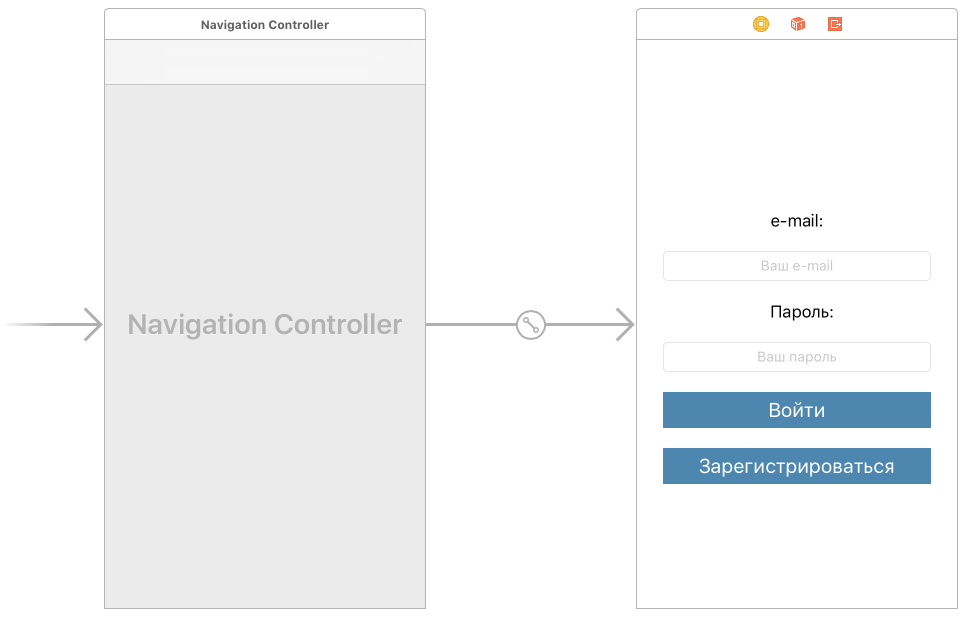
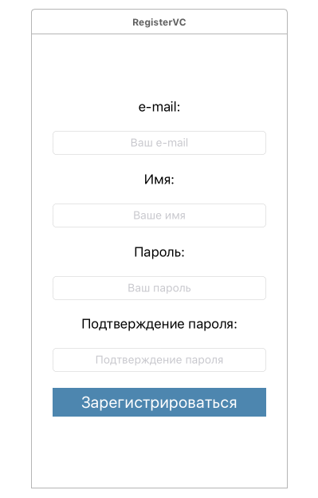
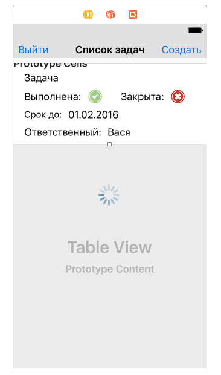

<a name="ToDoList"></a>

# Приложение "Список задач"

Данная документация содержит описание демонстрационного приложения "Список задач". Исходный код приложения доступен в репозитории <https://github.com/Scorocode/scorocode-SDK-swift/tree/master>.

Данное приложение позволяет ставить задачи сотрудникам и контролировать их выполнение. Функции прложения:

1. Зарегистрировать нового пользователя в БД приложения
2. Провести аутентификацию пользователя приложения
3. Провести деаутентификацию пользователя приложения.
4. Посмотреть список задач
5. Добавить задачу
6. Удалить задачу
7. Посмотреть подробную информацию о задаче
8. Изменить параметры задачи
9. Оставлять комментарии к задаче от постановщика и от исполнителя задачи
10. Назначать исполнителя задачи и срок выполнения
11. Проставлять статус задачи от исполнителя, закрывать задачу постановщиком
12. Оповестить поставновщика задач о выполнении задачи push-собщением
13. Оповестить исполнителя задачи о закрытии/доработке задачи push-собщением
14. Оповестить постановщика задач о просроченном сроке выполнения задачи исполнителем push-собщением
15. Смотреть историю изменения/выполнения задачи

## Структура данных приложения:

Создана коллекция `tasks` со следующими полями:

1. Closed (String)
2. Done (String)
3. bossComment (String)
4. closeDate (Date)
5. comment (String)
6. detailed (String)
7. name (String)
8. user (Pointer)

Создана коллекция `history` со следующими полями:

1. field (String)
2. task (Pointer)
3. value (String)

В системную коллекцию `Roles` добавлены 3 документа со следующими значениями поля `name` соответственно:

1. boss
2. manager

### Общие функции приложения

Для оповещения пользователя добавим extension к базовому классу `UIViewController` показа alert-сообщения с заголовком, текстом сообщения и выполняемым действием при закрытии сообщения:

```SWIFT
// Show alert with title and message and execute action
extension UIViewController {
    func showAlert(title: String, message: String, completion: (() -> Void)?) {
        let alert = UIAlertController(title: title, message: message, preferredStyle: .alert)
        let ok = UIAlertAction(title: "OK", style: .default) {
            action in
            completion?()
        }
        alert.addAction(ok)
        present(alert, animated: true, completion: nil)
    }
}
```

Для автоматического увеличения/уменьшения view текущего viewcontroller'а при показе системной клавиатуры добавим следующий extension:

```SWIFT
extension UIViewController {
    // register
    func setupViewResizerOnKeyboardShown() {
        NotificationCenter.default.addObserver(self,
                                               selector: #selector(UIViewController.keyboardWillShowForResizing),
                                               name: Notification.Name.UIKeyboardWillShow,
                                               object: nil)
        NotificationCenter.default.addObserver(self,
                                               selector: #selector(UIViewController.keyboardWillHideForResizing),
                                               name: Notification.Name.UIKeyboardWillHide,
                                               object: nil)
    }
    
    // resize view on show keyboard
    func keyboardWillShowForResizing(notification: Notification) {
        if let keyboardSize = (notification.userInfo?[UIKeyboardFrameEndUserInfoKey] as? NSValue)?.cgRectValue,
            let window = self.view.window?.frame {
            self.view.frame = CGRect(x: self.view.frame.origin.x,
                                     y: self.view.frame.origin.y,
                                     width: self.view.frame.width,
                                     height: window.origin.y + window.height - keyboardSize.height)
        } else {
            print("We're showing the keyboard and either the keyboard size or window is nil: panic widely.")
        }
    }
    
    // resize view on hide keyboard
    func keyboardWillHideForResizing(notification: Notification) {
        if let keyboardSize = (notification.userInfo?[UIKeyboardFrameEndUserInfoKey] as? NSValue)?.cgRectValue {
            let viewHeight = self.view.frame.height
            self.view.frame = CGRect(x: self.view.frame.origin.x,
                                     y: self.view.frame.origin.y,
                                     width: self.view.frame.width,
                                     height: viewHeight + keyboardSize.height)
        } else {
            print("We're about to hide the keyboard and the keyboard size is nil. Now is the rapture.")
        }
    }
}
```
Теперь при вызове функции `setupViewResizerOnKeyboardShown()` мы автоматически подпишемся на уведомления о показе/скрытии клавиатуры и будем вызывать соответствующие методы увеличения/уменьшения корневого view.

Добавим последний extension для автоматического скрытия клавиатуы при тапе вне области клавиатуры:
```SWIFT
// hide keyboard on tap out of the keyboard
extension UIViewController {
    func hideKeyboardWhenTappedAround() {
        let tap: UITapGestureRecognizer = UITapGestureRecognizer(target: self, action: #selector(UIViewController.dismissKeyboard))
        tap.cancelsTouchesInView = false
        view.addGestureRecognizer(tap)
    }
    
    func dismissKeyboard() {
        view.endEditing(true)
    }
}
```
В каждом из ViewController'ов с возможностью осуществления ввода с клавиатуры добавим вызов описанных функций приложения в методе `viewDidLoad()`:

```SWIFT
override func viewDidLoad() {
        super.viewDidLoad()
        // keyboard show-hide, resize window.
        setupViewResizerOnKeyboardShown()
        hideKeyboardWhenTappedAround()
    }
```

### Инициализация ScorocodeSDK

Добавим в метод `application(_ application: UIApplication, didFinishLaunchingWithOptions launchOptions: [UIApplicationLaunchOptionsKey: Any]?)` класса `AppDelegate` инициализацию ScorocodeSDK:
```SWIFT
//scorocode init
        let applicationId = "cd02126a02e44643ba38c923cf699bb7"
        let clientId = "900ca6a05f604eb8a88aac6941efcaa4"
        let accessKey = "32e4b1c15e7d470dbbacab57fa6e8406"
        let fileKey = "98bd371cdca944bcbebd45eb13fa17b6"
        let messageKey = "171f8ac1fa6f4ed8b3ec623739b2ad04"
        SC.initWith(applicationId: applicationId, clientId: clientId, accessKey: accessKey, fileKey: fileKey, messageKey: messageKey)
```
Посмотреть данные ключи можно на вкладке «Безопасность» настроек проекта.

## Стартовый экран приложения.

Создадим стартовый контроллер приложения с именем `LoginVC`. Для этого в Xcode выберем элемент `View Contoller` и перетащим его в storyboard. В приложении мы будем использовать 'UINavigationController' для навигации, поэтому выделим контроллер 'LoginVC' и выберем в Xcode `Editor → Embed in → Navigation Controller`. Накидаем на  стартовый контроллер поля для ввода логина, пароля, метки полей и две кнопки - для логина пользователя и регистрации пользователя. 

Стартовый ViewController приложения, соответствующий классу `LoginVC`, показан на рисунке:



На данном экране пользователь БД может ввести свой логин и пароль и системе. Приложения проведет проверку правильности введенных данных при помощи метода `login()` класса `LoginVC`. Использование данного метода показано в листинге:

```SWIFT
func login(email: String, password: String) {
    let scUser = SCUser()
    scUser.login(email, password: password) {
        success, error, result in
        if success {
            self.user.saveCredentials(email: email, password: password)
            self.user.parseUser(userDictionary: result?["user"] as? [String: Any])
            self.user.saveTokenToServer()
            self.showAlert(title: "Вход выполнен", message: "Добро пожаловать \(self.user.name) !") {
                let taskListVC = self.storyboard?.instantiateViewController(withIdentifier: "TaskListVC") as! TaskListVC
                self.navigationController?.show(taskListVC, sender: self)
            }
        } else {
            self.showAlert(title: "Вход не выполнен!", message: "проверьте email и пароль.", completion: nil)
        }
    }
    }
```

В данном методе мы создаем новый экземпляр класса `SCUser` и вызываем его метод `login` при этом информацию о email и password пользователя мы берем из соответствующих `TextFiled`. Метод `login` проверит тот факт, что пользователь с таким email и паролем существует в коллекции «users».

В случае если в коллекции «users» имеется пользователь с указанными email и password, то будет выполнен блок кода:

```SWIFT
self.user.saveCredentials(email: email, password: password)
self.user.parseUser(userDictionary: result?["user"] as? [String: Any])
self.user.saveTokenToServer()
self.showAlert(title: "Вход выполнен", message: "Добро пожаловать \(self.user.name) !") {
    let taskListVC = self.storyboard?.instantiateViewController(withIdentifier: "TaskListVC") as! TaskListVC
    self.navigationController?.show(taskListVC, sender: self)
}
```
Опишем вызываемые методы подробнее.

Метод 
```SWIFT
func saveCredentials(email: String, password: String) {
        self.email = email
        self.password = password
        UserDefaults.standard.set(email, forKey: "email")
        UserDefaults.standard.set(password, forKey: "password")
    }
```
сохранит введенные логин и пароль для последующего автоматического входа. Пользователю не потребуется вводить логин и пароль при каждом запуске приложения. Для смены пользователя можно будет произвести деавторизацию текущего пользователя на следующих экранах приложения,

Метод
```SWIFT
func parseUser(userDictionary: [String:Any]?) {
    if let name = userDictionary?["username"] as? String,
        let id = userDictionary?["_id"] as? String,
        let email = userDictionary?["email"] as? String,
        let roles = userDictionary?["roles"] as? [String] {
        self.name = name
        self.id = id
        self.email = email
        if let roleId = roles.first {
            var scQuery = SCQuery(collection: "roles")
            scQuery.equalTo("_id", SCString(roleId))
            scQuery.find({ (success, error, result) in
                if success, let role = (result?.values.first as? [String: Any])?["name"] as? String, role == "boss" {
                    self.isBoss = true
                }
            })
        } else {
            self.isBoss = false
        }
    }
}
```
парсит ответ от сервера при успешном логине пользователя и сохраняет в класс User. В ответе сервера (при успешном логине пользователя) содержатся все поля соотвествующей записи о пользователе в коллекции. Также здесь выполняется запрос имени роли пользователя - `manager` или `boss`. Для этого созадется новый объект `SCQuery`, объекту выставляется условие выборки и запускается поиск по запросу. 
Если запрос находит в списке ролей пользователя роль с именем `boss` - то пользователь получает возможность ставить задачи сотрудникам, удалять задачи, редактировать большую часть параметров задачи и видеть все задачи для всех пользователей.
Если запрос не находит в списке ролей пользователя роль с именем `boss` - то пользователь помечается как исполнитель задач. Исполнитель сможет видеть только свои задачи, писать комментарий исполнителя и менять статус задачи на "выполнено".

Метод
```SWIFT
func saveTokenToServer() {
    var scQuery = SCQuery(collection: "devices")
    scQuery.equalTo("deviceId", SCString(token)) // one device - one user.
    scQuery.remove() {
        success, error, result in
        if success {
            let scObject = SCObject(collection: "devices")
            scObject.set(["userId": SCString(self.id),
                          "deviceType": SCString("ios"),
                          "deviceId": SCString(self.token)
                ])
            scObject.save() {
                success, error, result in
                if success {
                    print("token saved.")
                } else if error != nil {
                    print("token didnt saved! Error: \(error.debugDescription)")
                }
            }
        } else {
            print("Error while updating device token, Error: \(error!)")
        }
    }
}
```
Сохраняет токен устройства пользователя на сервер в системную коллекцию `devices`. Токен нужен для рассылки push-сообщений пользователям. При этом, на случай, если на одном устрйстве будут работать несколько пользователей, будем сперва удалять сохраненный токен с сервера, если токен уже был сохранен на сервере. Удаление объекта производится методом `remove()` класса `SCQuery`. Сохранение нового токена в коллекцию `devices` осуществляется с помощью методов:
`set()` -  установить поля документа.
`save()` - сохранить документ.

В зависимости от результата попытки регистрации пользователя, приложение показывает пользователю сообщение и просит перепроверить вводимые данные, или сообщает об успешной регистрации и переходит на следующий экран.

На стартовом экране так же имеется кнопка «Зарегистрироваться», позволяющая зарегистрировать нового пользователя в системе (добавить его в коллекцию «users» БД). Регистрация пользователя осуществляется на следующем экране, добавим обработчик нажатия на кнопку "Зарегистрироваться":

```SWIFT
@IBAction func buttonRegisterTapped(_ sender: Any) {
    let registerVC = storyboard?.instantiateViewController(withIdentifier: "RegisterVC") as! RegisterVC
    navigationController?.pushViewController(registerVC, animated: true)
}
``` 

## Экран регистрации нового пользователя

Создадим новый ViewController с именем `RegisterVC` и добавим элементы TextField для ввода email, имени, пароля и подтверждения пароля пользователя. А также добавим кнопку "Зарегистрироваться". Данный экран показан на рисунке:



На данном экране вводятся все необходимые поля документа (характеризующие пользователя). Добавим обработчик нажатия для кнопки «Зарегистрировать» вызывающий метод `signup` класса `RegisterVC` для регистрации нового пользователя:
```SWIFT
@IBAction func buttonRegisterTapped(_ sender: AnyObject) {
    guard textFieldPassword.text == textFieldConfirmPassword.text, textFieldConfirmPassword.text != "" else {
        showAlert(title: "Пароли должны совпадать", message: "Пароль и подтверждение пароля не совпадают!", completion: nil)
        return
    }
    guard let email = textFieldEmail.text, email != "", let password = textFieldPassword.text, password != "" else {
        showAlert(title: "Регистрация не выполнена!", message: "Email и пароль доолжны быть заполнены.", completion: nil)
        return
    }
    signup(email: textFieldEmail.text!, password: textFieldPassword.text!, name: textFieldName.text ?? "")
}
```
Обработчик проверяет корректность введенных данных и вызывает метод регистраиции пользователя:

```SWIFT
func signup(email: String, password: String, name: String) {
    let scUser = SCUser()
    scUser.signup(name, email: email, password: password) { (success, error, result) in
        if success {
            self.user.saveCredentials(email: email, password: password)
            self.user.saveTokenToServer()
            self.user.parseUser(userDictionary: result?["user"] as? [String: Any])
            self.showAlert(title: "Успешно", message: "Вы успешно зарегистрировались") {
                let taskListVC = self.storyboard?.instantiateViewController(withIdentifier: "TaskListVC") as! TaskListVC
                self.navigationController?.pushViewController(taskListVC, animated: true)
            }
        } else {
            self.showAlert(title: "Регистрация не выполнена!", message: "Попробуйте еще раз.", completion: nil)
        }
    }
}
```
Если регистрация прошла успешно - сервер автоматически авторизует нового пользователя и присылает в ответе поля документа пользователя. Поэтому здесь мы можем вызвать те же методы, что и при авторизации пользоваеля. Методы были уже описаны выше.

В случае если регистрация пользователя прошла успешно (т.е если sdk инициализирован, все ключи указаны правильно и нет конфликта с уже существующими пользователями), будет выполнен переход к экрану списка задач.

## Экран списка задач.

Создадим экран списка задач приложения с именем `TaskListVC` и добавим на него элемент UITableView вместе с элементом UITableViewCell. На данном экране пользователь с ролью `maanger` будет видеть только свои задачи, а пользователь с ролью `boss` будет видеть все задачи. Кнопка "Создать" будет доступна только пользователю с ролью `boss`. На элемент UITableViewCell перетащим элементы для отображения информации о задаче - имя задачи, статусы задачи, ответственный и срок выполнения. Также добавим две кнопки - "Выйти" (для деаутентификации пользователя) и "Создать" (для создания новой задачи). Вид экрана список задач показана на картинке: 



Экран представляет собой `TableView` в который мы передаем информацию о задачах, хранящихся в БД. 
Добавим класс `TaskListCell`, который будет реализовывать внешний вид ячейки таблицы:

```SWIFT
class TaskListCell : UITableViewCell {
    
    @IBOutlet weak var labelTaskName: UILabel!
    @IBOutlet weak var imageViewStatusDone: UIImageView!
    @IBOutlet weak var imageViewStatusClosed: UIImageView!
    @IBOutlet weak var labelCloseDate: UILabel!
    @IBOutlet weak var labelUsername: UILabel!
    
    func setupCell(_ taskName: String, statusDone: Bool, statusClosed: Bool, closeDate: Date, username: String) {
        self.labelTaskName.text = taskName
        self.imageViewStatusDone.image = statusDone ? UIImage(named: "StatusOk") : UIImage(named: "StatusBad")
        self.imageViewStatusClosed.image = statusClosed ? UIImage(named: "StatusOk") : UIImage(named: "StatusBad")
        self.labelUsername.text = username
        let dateFormatter = DateFormatter()
        dateFormatter.dateFormat = "dd-MM-yyyy HH:mm"
        dateFormatter.timeZone = TimeZone.autoupdatingCurrent
        let dateObj = dateFormatter.string(from: closeDate)
        self.labelCloseDate.text = dateObj
        self.contentView.alpha = statusClosed ? 0.3 : 1.0
    }
}
```

В класс ячейки таблицы выведены аутлеты из сториборда приложения, представляющие собой элементы в ячейке таблицы, а так же создан метод `setupCell` для настройки внешнего вида таблицы.

Добавим в код контроллера экрана код для работы таблицы. Для удобства пользователей будем подкрашивать четные и нечетные ячейки разным цветом:

```SWIFT
func tableView(_ tableView: UITableView, numberOfRowsInSection section: Int) -> Int {
        return taskList.count
    }
    
    func tableView(_ tableView: UITableView, heightForFooterInSection section: Int) -> CGFloat {
        return 0.01
    }
    
    func tableView(_ tableView: UITableView, heightForHeaderInSection section: Int) -> CGFloat {
        return 0.01
    }

    func tableView(_ tableView: UITableView, cellForRowAt indexPath: IndexPath) -> UITableViewCell {
        let cell = tableView.dequeueReusableCell(withIdentifier: "cell") as! TaskListCell
        let task = taskList[indexPath.row]
        cell.backgroundColor = (indexPath.row % 2 == 0) ? UIColor(hex: 0xEFEFEF) : UIColor(hex: 0xFEFEFE)
        cell.setupCell(task.name, statusDone: task.isDone, statusClosed: task.isClose, closeDate: task.closeDate, username: task.username)
        return cell
    }
```

Для отображения информации создадим метод с именем `getTasks` код которого показан ниже:

```SWIFT
func getTasks() {
    view.isUserInteractionEnabled = false
    activityIndicator.startAnimating()
    taskList.removeAll()
    self.tableView.reloadData()
    var scQuery = SCQuery(collection: "tasks")
    if !user.isBoss {
        scQuery.equalTo("user", SCString(user.id))
    }
    scQuery.find() {
        success, error, result in
        self.view.isUserInteractionEnabled = true
        self.activityIndicator.stopAnimating()
        if success && (result?.count)! > 0 {
            for e in (result?.values)! {
                guard let elem = e as? [String:Any] else {
                    break
                }
                let task = Task()
                if let id = elem["_id"] as? String {
                    task.id = id
                }
                if let name = elem["name"] as? String {
                    task.name = name
                }
                if let isClose = elem["Closed"] as? Bool {
                    task.isClose = isClose
                }
                if let isDone = elem["Done"] as? Bool {
                    task.isDone = isDone
                }
                if let closeDate = elem["closeDate"] as? Date {
                    task.closeDate = closeDate
                }
                if let comment = elem["comment"] as? String {
                    task.comment = comment
                }
                if let bossComment = elem["bossComment"] as? String {
                    task.bossComment = bossComment
                }
                if let detailed = elem["detailed"] as? String {
                    task.detailed = detailed
                }
                if let user = elem["user"] as? String {
                    task.user = user
                }
                self.getUserNameAndAddTask(task)
            }
        } else {
            if success {
                self.showAlert(title: "", message: "Список задач пока пуст.", completion: nil)
            }
            self.view.isUserInteractionEnabled = true
            self.activityIndicator.stopAnimating()
        }
    }
}
```

Метод `getTasks` производит поиск документов в коллекции `tasks` с помощью метода `find()` класса `SCQuery`. При этом, если пользователь не обладает ролью `boss`, то в запрос устанавливается условие для поиска документов только для текущего пользователя:

```SWIFT
if !user.isBoss {
        scQuery.equalTo("user", SCString(user.id))
    }
```

Далее метод `getTasks` парсит ответ сервера с документами, разбирая поля документа. После чего происходит вызов метода:
```SWIFT
func getUserNameAndAddTask(_ task: Task) {
        view.isUserInteractionEnabled = false
        activityIndicator.startAnimating()
        var scQuery = SCQuery(collection: "users")
        scQuery.fields(["username"])
        scQuery.equalTo("_id", SCString(task.user))
        scQuery.find() {
            success, error, result  in
            if success && (result?.count)! > 0 {
                if let username = (result?.values.first as? [String: Any])?["username"] as? String {
                    task.username = username
                }
            } else {
                self.showAlert(title: "Ошибка!", message: "Не найдено имя пользователя для задачи \(task.name)", completion: nil)
            }
            self.taskList.append(task)
            //sort by fields: isClosed, closeDate
            self.taskList.sort(by: {t1, t2 in
                if t1.isClose == t2.isClose {
                    return t1.closeDate.compare(t2.closeDate) == ComparisonResult.orderedAscending
                }
                return !t1.isClose && t2.isClose })
            self.tableView.reloadData()
            self.view.isUserInteractionEnabled = true
            self.activityIndicator.stopAnimating()
        }
    }
```
Данный метод производит запрос поля "username" из коллекции "users" , чтобы сохранить в задачу имя пользователя. Меод парсит ответ от сервера, после чего сохраняет задачу в список `taskList`. Так как запросы выполняется асинхронно, то после каждого добавления задачи в список мы заново сортируем список. Сначала по дате выполнения, а потом по статусу - "закрыта" или "не закрыта". Закрытые задачи показываются всегда в конце списка, для более удобной навигации.

Добавим в код данного экрана обработчик кнопки "Выход":

```SWIFT
@IBAction func buttonLogoutPressed(_ sender: AnyObject) {
    let alert = UIAlertController(title: "Выйти из системы?", message: nil, preferredStyle: .alert)
    let logout = UIAlertAction(title: "Выйти", style: .destructive) {
        action in
        self.user.clear()
        self.navigationController?.popToRootViewController(animated: true)
    }
    alert.addAction(logout)
    let cancel = UIAlertAction(title: "Отмена", style: .cancel, handler: nil)
    alert.addAction(cancel)
    present(alert, animated: true, completion: nil)
}
```
При деаутентификации пользователя мы должны очистить данные пользователя, сохраненные локально. Для этого вызывается метод `clear` у класса `User`:

```SWIFT
func clear() {
    id = ""
    email = ""
    password = ""
    name = ""
    isBoss = false
    token = ""
    
    UserDefaults.standard.set("", forKey: "email")
    UserDefaults.standard.set("", forKey: "password")
    //remove token from server:
    removeTokenFromServer()
}
```
Метод очистки обнуляет поля пользователя и удаляет сохраненный токен push-сообщений с сервера, посредством вызова метода `removeTokenFromServer` у класса `User':

```SWIFT
func removeTokenFromServer() {
    var scQuery = SCQuery(collection: "devices")
    scQuery.equalTo("deviceId", SCString(self.token)) // one device - one user.
    scQuery.remove() {
        success, error, result in
        if success {
            print("token removed")
        } else if error != nil {
            print("Error while updating device token, Error: \(error!)")
        }
    }

}
```
Метод удаления токена с сервера делает запрос в коллекцию "devices", устанавливая условие выборки поиска документа по токену. Далее происходит удаление документа из коллекции.

Добавим в код экрана обработчик нажатия на кнопку "Создать":

```SWIFT
@IBAction func buttonCreateTouchUpInside(_ sender: AnyObject) {
        let taskDetailVC = storyboard?.instantiateViewController(withIdentifier: "TaskDetailVC") as! TaskDetailVC
        taskDetailVC.isCreateMode = true
        navigationController?.pushViewController(taskDetailVC, animated: true)
    }
```

Обработчик осуществляет переход на экран показа деталей задачи, одновременно являющийся и экраном создания задачи. Для задания режима работы экрана деталей задачи устанавливается переменная `isCreateMode`. Так как мы нажимаем на кнопку создания новой задачи, то переменная `isCreateMode` устанавливается в зачение `true`

Добавим в код контроллера экрана обработку клика по ячейке таблицы. При клике на ячеке таблицы пользователь переходит на экран показа деталей задачи. Для этого установим вышеописанную переменную `isCreateMode` в значение `false`. А также передадим данные задачи из ячейки:

```SWIFT
func tableView(_ tableView: UITableView, didSelectRowAt indexPath: IndexPath) {
        let taskDetailVC = storyboard?.instantiateViewController(withIdentifier: "TaskDetailVC") as! TaskDetailVC
        taskDetailVC.task = taskList[indexPath.row]
        taskDetailVC.isCreateMode = false
        navigationController?.pushViewController(taskDetailVC, animated: true)
    }
```

## Экран с деталями задачи / создания новой задачи.

Создадим UIViewController с именем `TaskDetailVC` и добавим его на storyboard приложения. Набросаем элементы, отображающие параметры задачи - поле для выбора ответственного пользователя, срок выполнения задачи, название задачи, подробное описание задачи, задача выполнена, задача закрыта, комментарий исполнителя, комментарий постановщика, история задачи и кнопка "удалить задачу". Вид экрана показан на рисунке:


На этом экране пользователь вводит всю необходиму информацию о задаче и нажимает кнопку "Сохранить". При этом программа создает новый документ, заполняет его поля и сохраняет на сервере. Режим работы экрана зависит от переменной `isCreateMode` - true для режима создания новой задачи и false для редактирования существующей задачи. Для назначения ответственных нам понадобятся имена и идентификаторы пользователей. Имена мы будем показывать на экране, а связывать задачу с учетной записью пользователя - по идентификаторам. Добавим код в метод `viewDidLoad` загрузки имен и идентификаторов пользователей:

```SWIFT
override func viewDidLoad() {
        super.viewDidLoad()
        setupViewResizerOnKeyboardShown()
        hideKeyboardWhenTappedAround()
        getUserListForUserPicker()
        if isCreateMode == false{
            getHistory()
        }
    }
```
Метод `getUserListForUserPicker` имеет вид:
```SWIFT
func getUserListForUserPicker() {
    userList.removeAll()
    // if we look details of task and we are not a boss
    if (!isCreateMode && !user.isBoss) || task.isClose {
        userList.append(IdAndName(id: task.user, name: task.username))
        pickerViewUsers.reloadAllComponents()
    } else {
        // if we create new task or boss opens task:
        var scQuery = SCQuery(collection: "users")
        scQuery.fields(["_id","username"])
        scQuery.notEqualTo("_id", SCString(user.id))
        scQuery.find() {
            success, error, result in
            if success && (result?.count)! > 0 {
                for elem in (result!.values) {
                    if let id = (elem as? [String: Any])?["_id"] as? String,
                        let name = (elem as? [String: Any])?["username"] as? String {
                        self.userList.append(IdAndName(id: id, name: name))
                    }
                }
            } else {
                self.showAlert(title: "Ошибка!", message: "Не удалось получить список исполнителей", completion: nil)
            }
            self.userList.sort(by: {$0.name < $1.name})
            self.pickerViewUsers.reloadAllComponents()
            //select current user
            for (index, user) in self.userList.enumerated() {
                if user.id == self.task.user {
                    self.pickerViewUsers.selectRow(index, inComponent: 0, animated: true)
                    break
                }
            }
        }
    }
}
```
При запуске метод проверяет режим работы экрана и роль пользователя. Если задача закрыта, или задачу смотрит исполнитель - мы не будем делать запрос списка имен и идентификаторов пользователей, а покажем уже имеющийся id и имя исполнителя. В других случаях,  мы делаем запрос к коллекции `users` и сохраняем всех пользователей, кроме текущего.  Дальше происходит парсинг ответа сервера и сохранение пары "идентификатор, имя пользователя" в список `userList`. далее мы сортируем список `pickerViewUsers` и переходим на текущего пользователя у элемента `pickerViewUsers`. 

Метод `viewDidLoad` также вызывает метод для загузки истории задачи, если экран находится в режиме редактирования:

```SWIFT
 func getHistory() {
        historyList.removeAll()
        var scQuery = SCQuery(collection: "history")
        scQuery.fields(["createdAt","value","field"])
        scQuery.equalTo("task", SCString(task.id))
        scQuery.find() {
            success, error, result in
            if success && (result?.count)! > 0 {
                for elem in (result?.values)! {
                    if let date = (elem as? [String: Any])?["createdAt"] as? Date,
                        let value = (elem as? [String: Any])?["value"] as? String,
                        let field = (elem as? [String: Any])?["field"] as? String {
                        self.historyList.append(History(date: date, value: value, field: field))
                    }
                }
            } else {
                self.showAlert(title: "Ошибка!", message: "Не удалось загрузить историю задачи", completion: nil)
            }
            self.historyList.sort(by: {$0.date.compare($1.date) == ComparisonResult.orderedAscending})
            self.tableViewHistory.reloadData()
        }
    }
```
Данный метод делает выборку из коллекции `history` с возвратом полей createdAt (время действия), value (новое значение), field (имя поля, которое было изменено). После выборки, парсится ответ от сервера и документ истории сохраняется в список `historyList`

Рассмотрим самый большой метод экрана `saveHistory`, который реализует сохранение истории изменений:

```SWIFT
func saveHistory(_ newTask: Task) {
        var items = [SCObject]()
        var mode = ""
        /* mode values:
         var UserHasDoneTask
         var BossHasCloseTask
         var BossHasntDone
        */
        if isCreateMode {
            let scObject = SCObject(collection: "history")
            scObject.set(["task": SCString(newTask.id),
                "field": SCString("Задача:"),
                "value": SCString("Создана.")
                ])
            items.append(scObject)
        } else {
            if task.name != newTask.name {
                let item = SCObject(collection: "history")
                item.set(["task": SCString(newTask.id), "field": SCString("Название задачи изменено:"), "value": SCString(newTask.name)])
                items.append(item)
            }
            if task.comment != newTask.comment {
                let item = SCObject(collection: "history")
                item.set(["task": SCString(newTask.id), "field": SCString("Исполнитель изменил комментарий:"), "value": SCString(newTask.comment)])
                items.append(item)
            }
            if task.bossComment != newTask.bossComment {
                let item = SCObject(collection: "history")
                item.set(["task": SCString(newTask.id), "field": SCString("Босс изменил комментарий:"), "value": SCString(newTask.bossComment)])
                items.append(item)
            }
            if task.detailed != newTask.detailed {
                let item = SCObject(collection: "history")
                item.set(["task": SCString(newTask.id), "field": SCString("Описание изменено:"), "value": SCString(newTask.detailed)])
                items.append(item)
            }
            if task.closeDate != newTask.closeDate {
                let dateFormatter = DateFormatter()
                dateFormatter.timeZone = TimeZone.autoupdatingCurrent
                dateFormatter.dateFormat = "dd-MM-yyyy HH:mm"
                let value = dateFormatter.string(from: newTask.closeDate)
                let item = SCObject(collection: "history")
                item.set(["task": SCString(newTask.id), "field": SCString("Изменен срок:"), "value": SCString(value)])
                items.append(item)
            }
            if task.username != newTask.username {
                let item = SCObject(collection: "history")
                item.set(["task": SCString(newTask.id), "field": SCString("Исполнитель изменен:"), "value": SCString(newTask.username)])
                items.append(item)
            }
            if task.isDone != newTask.isDone {
                let item = SCObject(collection: "history")
                let statusString = newTask.isDone ? "Выполнена." : "Не выполнена."
                item.set(["task": SCString(newTask.id), "field": SCString("Задача:"), "value": SCString(statusString)])
                items.append(item)
                if newTask.isDone && !user.isBoss {
                    mode = "UserHasDoneTask"
                } else if !newTask.isDone && user.isBoss {
                    mode = "BossHasntDone"
                }
            }
            if task.isClose != newTask.isClose {
                let item = SCObject(collection: "history")
                item.set(["task": SCString(newTask.id), "field": SCString("Задача:"), "value": SCString("Закрыта.")])
                items.append(item)
                if newTask.isClose {
                    mode = "BossHasCloseTask"
                }
            }
            alertUser(mode: mode, userId: newTask.user, userName: newTask.username, taskName: newTask.name)
        }
        //try to save
        for i in 0..<items.count {
            let scObject = items[i]
            activityIndicator.startAnimating()
            contentView.isUserInteractionEnabled = false
            scObject.save() {
            success, error, result in
                self.activityIndicator.stopAnimating()
                self.contentView.isUserInteractionEnabled = true
                if !success {
                    self.showAlert(title: "Ошибка!", message: "Не удалось сохранить элемент истории", completion: nil)
                }
                if i == items.count - 1 {
                    self.navigationController?.popViewController(animated: true)
                }
            }
        }
    }
```
В метод передается параметр `newTask`,  представляющий собой новые параметры задачи. Если экран работает в режиме создания новой задачи - все просто, записываем на сервер один документ с записью о созднии задачи. Если экран работает в режиме редактирования, то мы должны сравнить исходное состояние задачи с измененнным ссстяонимем задачи. Для этого мы поочередно сравниваем переменные двух задач, и при несовпадении - добавляем запись об изменении в список изменений `items`.
После формирования списка документов запускается цикл сохранения документов на сервер. Так как запросы на сохранение документов на сервер выполняются асинхронно, после сохранения последнего документа из списка мы возвращаемся на экран списка задач.
Так же в данном методе проверяется, не изменился ли статус задач. Если статус поменялся - мы должны оповестить об этом исполнителя или постановщика задачи с помощью push-сообщения. Отлеживаются три события:
`var UserHasDoneTask` - исполнитель изменил статус задачи на "Выполнено"
`var BossHasCloseTask` - постановщик изменил статус задачи на "закрыто"
`var BossHasntDone` - постановщик изменил статус задачи на "Не выполнено", то есть остался неудовлетворен результатом выполнения задачи и послал задачу на доработку.
данные события отправляются в скрипт на сервере, с помощью метода `alertUser`:

```SWIFT
//send push to user/boss, if the task has changes done/close status
func alertUser(mode: String, userId: String, userName: String, taskName: String) {
        guard mode != "" else {
            return
        }
        var rolesQuery = SCQuery(collection: "roles")
        var usersQuery = SCQuery(collection: "users")
        rolesQuery.equalTo("name", SCString("boss"))
        rolesQuery.fields(["_id"])
        rolesQuery.find { (success, error, result) in
            if success, let roleBossId = (result?.values.first as? [String: Any])?["_id"] as? String {
                usersQuery.equalTo("roles", SCArray(stringArray: [roleBossId]))
                usersQuery.find({ (success, error, result) in
                    if success, let bossId = (result?.values.first as? [String: Any])?["_id"] as? String{
                        let pool = ["mode":mode, "userId":userId, "userName":userName, "taskName":taskName, "bossId": bossId]
                        
                        let script = SCScript(id: self.kTaskChangeStatusSendPushScriptID)
                        script.run(pool: pool, debug: false) { (success, error) in
                            if success {
                                print("script \(self.kTaskChangeStatusSendPushScriptID) was executed.")
                            } else if error != nil {
                                print(error!)
                            }
                        }
                    }
                })
            }
        }
    }
```
Данный метод запускает скрипт на сервере, передав ему тип события. Передавать параметры скрипту можно с помощью словаря `pool`. В данном методе серверному скрипту передаются переменные:
`mode` -  вид события
`userId` - идентификатор иполнителя задачи
`userName` - имя исполнителя задачи
`taskName` - название задачи
'bossId' - идентификатор поставновщика
Данный метод сначала запрашивает идентификатор роли "boss", потом ищет пользователя с такой ролью. Если пользователь найден - скрипт запускается методом `run` класса `SCScript`.

Исходный код скрипта:
```JavaScript
var Scorocode = require('scorocode');
var UserHasDoneTask = " выполнил задачу: "
var BossHasCloseTask = "Босс закрыл задачу: "
var BossHasntDone = "Босс не одобрил выполнение задачи: "

Scorocode.Init({
    ApplicationID: "98bc4bacb5edea727cfb8fae25f71b59",
    JavaScriptKey: "24d0d42ab02cf546b88b9134cf1d1468",
    FileKey: "351cb3d71efef69e346ac5657dd16c1c",
    MessageKey: "35d5a173e0391ae83d60a6a756a44051"
});


userClosedTask();

function userClosedTask() {
    // user has closed the task
    var Devices = new Scorocode.Query("devices");
    var Broadcast = new Scorocode.Messenger();
    var userId = ""
    var bossId = pool["bossId"]
    var userName = pool["userName"]
    var taskName = pool["taskName"]
    var text = ""
    var mode = pool["mode"]
    console.log(pool)
    switch (mode) {
    case 'BossHasCloseTask':
        userId = pool["userId"]
        text = BossHasCloseTask + taskName
        break;
    case 'BossHasntDone':
        userId = pool["userId"]
        text = BossHasntDone + taskName
        break;
    case 'UserHasDoneTask':
        userId = bossId
        text = userName + UserHasDoneTask + taskName
        break;
    default:
        return
    }
    //send push to boss
    Devices.equalTo("userId", userId)
        Broadcast.sendPush({
            where: Devices,
                data: {"text": text}//text}
            })
            .then((success)=>{
                console.log("success!");
                console.log(success);
            })
            .catch((error)=>{
                        console.log("error!");
                        console.log(error)
            });
    
}
```

Подробную информацию о написании серверных скриптов вы можете найти на портале документации к Scorocode <http://scorocode.github.io/scorocode-docs/JS/javascript/>

Добавим так же обработчик нажатия на кнопку "Сохранить":
```SWIFT
 @IBAction func buttonSaveTouchUpInside(_ sender: AnyObject) {
        //set task params
        let newTask = Task()
        newTask.user = userList[pickerViewUsers.selectedRow(inComponent: 0)].id
        newTask.username = userList[pickerViewUsers.selectedRow(inComponent: 0)].name
        newTask.bossComment = textViewBossComment.text
        newTask.closeDate = datePickerDate.date
        newTask.comment = textViewComment.text
        newTask.detailed = textViewDetailed.text
        if isCreateMode {
            newTask.isClose = false
            newTask.isDone = false
        } else {
            newTask.isClose = switchIsClosed.isOn
            newTask.isDone = switchIsDone.isOn
        }
        if let text = textFieldTaskName.text {
            newTask.name = text
        }
        newTask.id = task.id
        //creating new task document or update
        let scObject = isCreateMode ? SCObject(collection: "tasks") : SCObject(collection: "tasks", id: task.id)
        scObject.set(["name": SCString(newTask.name),
            "Done": SCBool(newTask.isDone),
            "Closed": SCBool(newTask.isClose),
            "comment": SCString(newTask.comment),
            "closeDate": SCDate(newTask.closeDate),
            "detailed": SCString(newTask.detailed),
            "bossComment": SCString(newTask.bossComment),
            "user": SCString(newTask.user),
        ])
        //try to create or update
        activityIndicator.startAnimating()
        contentView.isUserInteractionEnabled = false
        scObject.save() {
            success, error, result in
            self.activityIndicator.stopAnimating()
            self.contentView.isUserInteractionEnabled = true
            if success {
                // get task id
                if self.isCreateMode {
                    if let id = result?["_id"] as? String {
                        newTask.id = id
                    }
                }
                self.saveHistory(newTask)
            } else {
               self.showAlert(title: "Ошибка!", message: "Не удалось сохранить задачу. Попробуйте еще раз", completion: nil)
            }
        }
    }

```
 Обработчик создает новую задачу, записывает в нее требуемые поля, и пытается сохранить или обновить соотвествующий документ задачи на сервере. Напомним, то при обновлении длокумента на сервере необходимо инициализировать класс `SCObject` с идентификатором:
 ```SWIFT
SCObject(collection: "tasks", id: task.id)

```
При сохранении документа на сервер в случае успеха сервер посылает ответ содержащий идентификатор документа. Мы можем воспользоватся этим и сохранить нужный нам идентификатор задачи, если мы создаем нову задачу, дабы не делать еще один запрос к серверу:
```SWIFT
scObject.save() {
            success, error, result in
            self.activityIndicator.stopAnimating()
            self.contentView.isUserInteractionEnabled = true
            if success {
                // get task id
                if self.isCreateMode {
                    if let id = result?["_id"] as? String {
                        newTask.id = id
                    }
                }
                self.saveHistory(newTask)
            } else {
               self.showAlert(title: "Ошибка!", message: "Не удалось сохранить задачу. Попробуйте еще раз", completion: nil)
            }
        }
```

Добавм обработчик нажатия на кнопку "Удалить задачу":

```SWIFT
@IBAction func buttonDeleteTap(_ sender: Any) {
        let scObject = SCObject(collection: "tasks", id: task.id)
        scObject.remove { (success, error, result) in
            if success {
                var scQuery = SCQuery(collection: "history")
                scQuery.equalTo("task", SCString(self.task.id))
                scQuery.remove({ (success, error, result) in
                    if success {
                        self.showAlert(title: "Успешно", message: "Задача и ее история удалена") {
                            self.navigationController?.popViewController(animated: true)
                        }
                    }
                })
            }
        }
    }
```
Обработчик делает запрос к серверу на удаление документа задачи. Также, в случае успеха, удаляется и вся история, связанная с удаленной задачей.

### Скрипт оповещения постановщика задач о просроченных сроках
Добавим на сервер скрипт:
```JavaScript
var Scorocode = require('scorocode');
var bossId = "qRmX5rHsc6"

Scorocode.Init({
    ApplicationID: "98bc4bacb5edea727cfb8fae25f71b59",
    JavaScriptKey: "24d0d42ab02cf546b88b9134cf1d1468",
    FileKey: "351cb3d71efef69e346ac5657dd16c1c",
    MessageKey: "35d5a173e0391ae83d60a6a756a44051"
});

alertBossAboutExpiredTasks();

function alertBossAboutExpiredTasks() {
    // Создадим новый экземпляр запроса к коллекции Tasks
var Tasks = new Scorocode.Query("tasks"); 
var TasksIsDone = new Scorocode.Query("tasks");
var TasksIsClosed = new Scorocode.Query("tasks");
var TasksIsOver = new Scorocode.Query("tasks");
// Установим условие выборки - запросить все объекты, с истекшим сроком
var now = new Date()
TasksIsOver.lessThan("closeDate", now.toISOString()) 
// Установим условие выборки - запросить все выполненные пользователем задачи
TasksIsDone.notEqualTo("Done", true)
// Установим условие выборки - запросить все закрытые боссом задачи
TasksIsClosed.notEqualTo("Closed", true)
    Tasks.and(TasksIsDone).and(TasksIsClosed).and(TasksIsOver)
        .find()
        .then((result) => {
            console.log(result.result)
            parseQueryResultAndSendPushToBoss(result.result)
        })
        .catch((error) => {
            console.log(error)
        });
}

function parseQueryResultAndSendPushToBoss(queryResult)  {
    var Broadcast = new Scorocode.Messenger();
    var Devices = new Scorocode.Query("devices");
    var expiredTasks = [];
    for (var index in queryResult) {
        var textMessage = "Просрочена задача: \"" + queryResult[index].name + "\""
        expiredTasks.push({"text":textMessage,"userid":queryResult[index].user})
    }
    //send to boss expired tasks
    for (var key in expiredTasks) {    
        var task = expiredTasks[key]
        var id = task["userid"]    
        var text = task["text"]
        console.log(id,text)
        Devices.equalTo("userId", bossId)
        Broadcast.sendPush({
            where: Devices,
                data: {"text": text}
            })
            .then((success)=>{
                console.log("success!");
                console.log(success);
            })
            .catch((error)=>{
                        console.log("error!");
                        console.log(error)
            });
    }
}
```
Данный скрипт поставим на периодический запуск какждые 10 минут. Скрипт будет автоматически запускаться, проверять статус задач и оповещать постановщика задач push-уведомлением. Настроить расписание запуска скрипта можно на вкладке "Настройки" скрипта.
