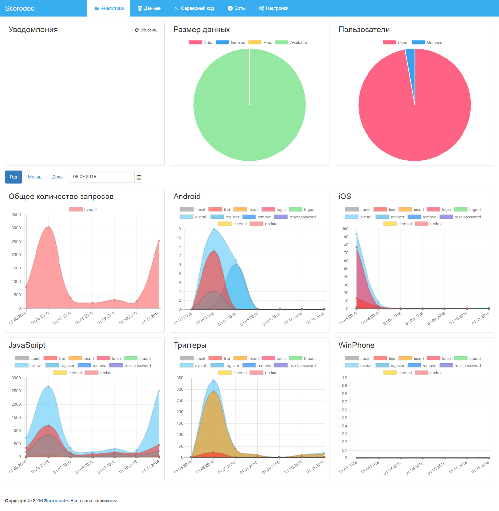

Для работы с приложением щелкните в области виджета существующего приложения. Откроется страница работы с приложением на закладке «Аналитика».

На странице приложения расположены следующие функциональные закладки:

* Аналитика;
* Данные;
* Серверный код;
* Настройки.

Для быстрого перехода на нужную функциональную закладку можно щелкнуть по соответствующей пиктограмме в меню виджета приложения на странице "Приложения".

