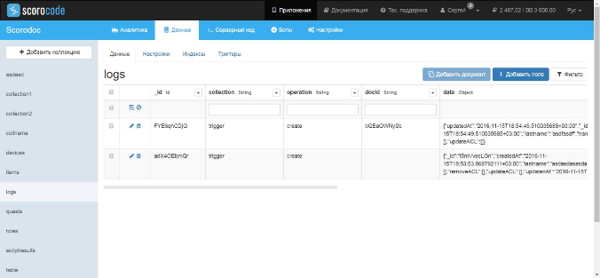

На функциональной закладке «Данные» расположен перечень коллекций и набор инструментов по управлению коллекциями приложения. На странице вновь созданного приложения присутствуют 3 системные коллекции:

* roles - роли пользователей;
* users - пользователи;
* devices - устройства.

Системные коллекции нельзя удалить. По умолчанию выбрана коллекция приложения – users. Каждая коллекция имеет следующий инструментарий для управления:

* Данные;
* Настройки;
* Индексы;
* Триггеры.

## Данные коллекции

По умолчанию для выбранной коллекции активна закладка «Данные».

Каждая коллекция отображается в виде таблицы с набором полей (колонки таблицы), которая содержит документы этой коллекции. В документах каждой коллекции присутствуют системные поля, которые создаются автоматически, и которые нельзя удалить:

* id - идентификатор;
* *ACL - три поля типа ACL (access control list), определяющих права на чтение (readACL), на обновление (* updateACL) и на удаление (removeACL) документа;
* createdAt - дата и время создания документа;
* updatedAt - дата и время последнего изменения документа

Поля id, createdAt и updatedAt не редактируются, их значения устанавливаются системой автоматически.

## Добавление документа в коллекцию

Для создания нового документа коллекции нажмите на ссылку «Добавить документ», далее щелкните на пиктограмму для вновь созданной записи таблицы и подтвердите сохранение нового документа. В новом документе автоматически будут заполнены поля id, createdAt и updatedAT.

## Удаление документа из коллекции

Для удаления документов из коллекции выделите их в таблице с помощью checkbox и нажмите на появившуюся ссылку «Удалить». Для ввода значения доступного для редактирования поля выбранного документа щелкните два раза в его области таблицы. Введите одно или несколько значений через запятую.

## ACL- поля

ACL – поля могут включать в себя только значения идентификаторов пользователей из коллекции users и идентификаторов ролей из коллекции roles длиной 10 символов и звездочку (*). Использование звездочки подразумевает указание доступности функции для всех пользователей коллекций users и roles. Используйте функции copy/past для ввода идентификаторов пользователей из коллекции users и идентификаторов ролей из коллекции roles. ACL – поля являются массивами. Список значений вводится через ",", каждое значение должно быть взято в кавычки, например ["*","0123456789"].

## Добавление поля

Для добавления поля в документ коллекции нажмите на ссылку «Добавить поле».

Укажите наименование поля (латинские буквы и цифры) и выберите тип поля из следующего списка:

* Datе - дата/время
* Boolean - логическое значение true/false
* String - строка
* File - файл
* Number - число
* Password - дайджест строки с использованием алгоритма md5
* Array - массив произвольных данных
* Object - объект, состоящий из пар "ключ" : <произвольное значение>
* Relation - массив идентификаторов документов из другой коллекции
* Pointer - идентификатор документа из другой коллекции

Имена полей не должны повторяться в рамках одной коллекции. Для подтверждения сохранения введенных данных нажмите на кнопку «Добавить поле». Новое поле будет добавлено в конец таблицы.

## Фильтр

Для поиска документов в коллекции перейдите по ссылке «Фильтр». В всплывающем окне выберите перечень полей из предлагаемого списка и укажите для каждого поля логическое условие и значение для фильтрации.

При выборе нескольких полей для условия фильтрации они будут объединяться по условию «И».

## Настройки коллекции

Для выполнения настройки коллекции выберите коллекцию из списка и перейдите на закладку «Настройки»

Для использования механизма доступа ACL заданного в описании документов коллекции установите опцию «Использовать ACL документов». В противном случае доступы ACL документов коллекции будут игнорироваться.

Укажите время жизни ссылок на файлы в облаке в секундах. Этот параметр задает время действия генерируемой временной ссылки на файл, получаемой при вызове через API. По умолчанию ссылка действует 120 сек.

Укажите пользователей и/или роли, имеющие права доступа на создание, чтение, редактирование и удаление выбранной коллекции. Для добавления пользователей и/или ролей воспользуйтесь ссылкой «Добавить», указав id пользователя или роли.

Для разрешения доступа на создание, чтение, редактирование и удаление документов коллекции анонимным пользователям выберите соответствующую опцию для записи «Анонимные пользователи».

