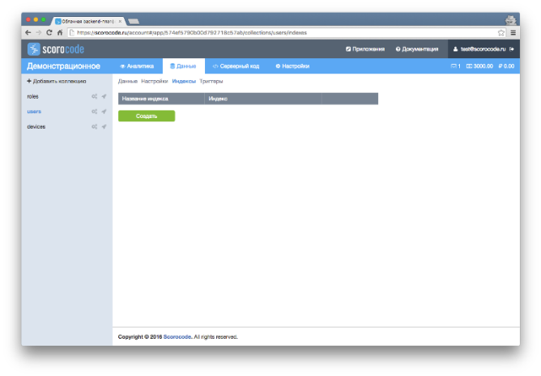
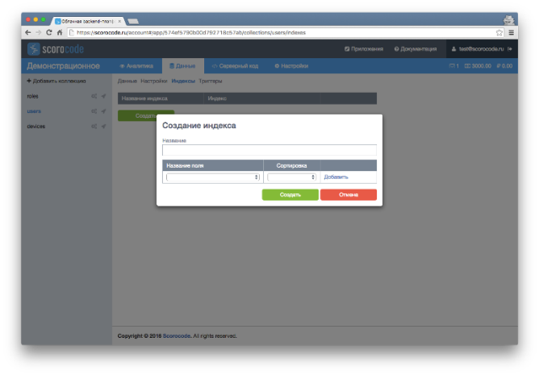

На закладке “Индексы» можно создавать индексы по полям коллекции. Для создания индекса нажмите на кнопку «Создать». В всплывающем окне введите наименование индекса (латинские буквы и цифры), далее выберите поля коллекции из предлагаемого списка. Для выбранного поля укажите тип сортировки (1 - по возрастанию, -1 - по убыванию). Для формирования составного индекса из нескольких полей нажмите на ссылку «Добавить». Удалить поле из индекса можно по ссылке «Удалить».

После сохранения индекс появится в списке индексов коллекции приложения и будет запущен процесс создания индекса.

!!! warning "Влияние индексов на дисковое пространство"
    Индексы значительно увеличивают занимаемое данными дисковое пространство.