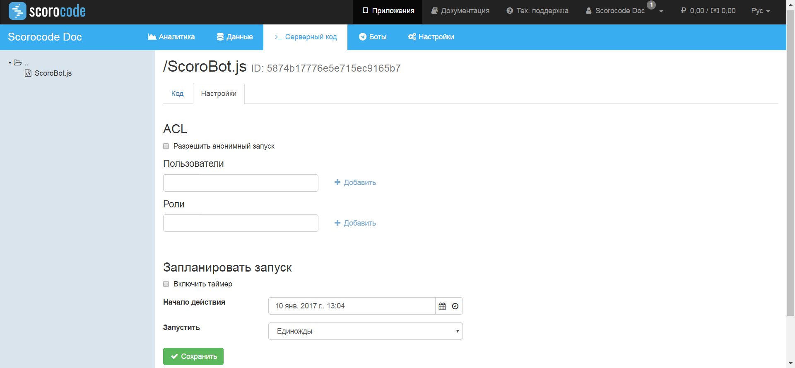
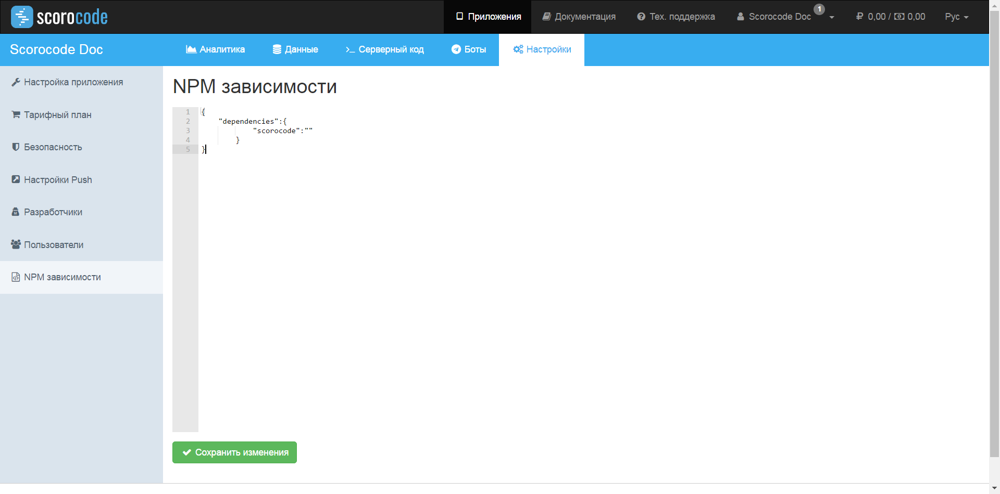

## Общая информация

Серверный код – это скрипты на JavaScript, выполняемые на сервере с помощью движка Google V8. Разработанный серверный код выполняется по расписанию (плану) или одноразово по вызову через метод API.Для создания нового скрипта нажмите кнопку "Создать".


При создании нового серверного скрипта, в него автоматически будет подставлен следующий код инициализации Scorocode JavaScript SDK с подставленными ключами ApplicationId, JavaScriptKey и MasterKey приложения:

```js
// Init Scorocode
var sc = require('scorocode')

sc.Init({
    ApplicationID: "xxx",
    JavaScriptKey: "xxx",
    MasterKey:     "xxx"
})

// Write your code here
```

Для сохранения введенного кода нажмите на ссылку «Сохранить». Для допуска запуска кода анонимному пользователю (без авторизации) установите соответствующий флаг на закладке «ACL». Для настройки плана запуска серверного кода перейдите на закладку «Запланировать запуск». Задайте опцию «Включить таймер» для выполнения созданного серверного кода по расписанию. Далее настройте расписание и укажите дату начала его действия.



Возможны следующие варианты расписания:

* Единожды;
* Произвольно через заданное время (дни, часы, минуты);
* Ежедневно (по заданным дням недели и в заданное время);
* Ежемесячно (по заданным месяцам, дням месяца и в заданное время).


Серверный код запускается в отдельном контексте, и при запуске в нем доступны следующие объекты:

`pool` – произвольный объект, переданный при вызове метода выполнения скрипта через API, содержащий переданные данные.

## Поддержка NPM модулей

Для того чтобы подключить сторонние модули в вашем скрипте, необходимо описать все имеющиеся зависимости. Для этого перейдите в раздел Настройки приложения и выберите пункт NPM зависимости.



В секции `dependencies` опишите все модули, которые вы собираетесь использовать, где свойство - это название модуля, а значение - необходимая версия (вы можете оставить значение версии пустым, в этом случае будет установлена последняя версия модуля).

Пример:

```JSON
    {
        "dependencies": {
            "scorocode": ""
        }
    }
```
    
Использовать подключенный SDK Scorocode можно, подключив его в серверный код с помощью `var scorocode = require('scorocode')`