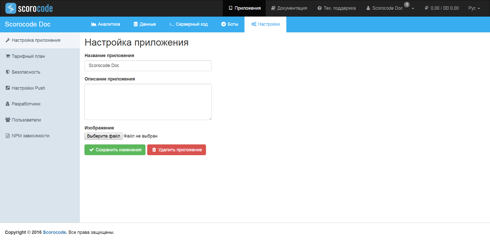
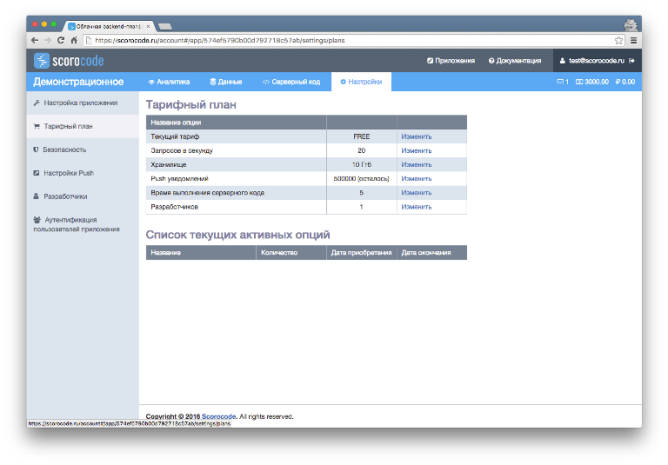
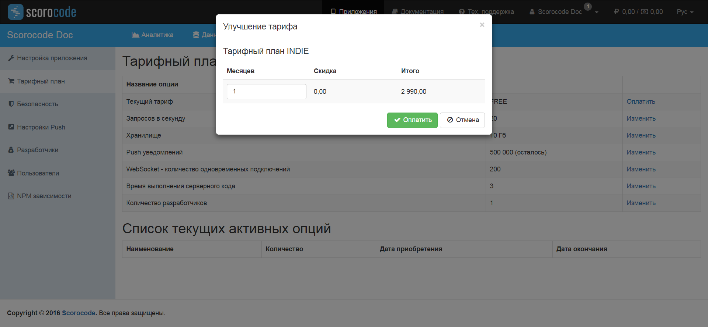
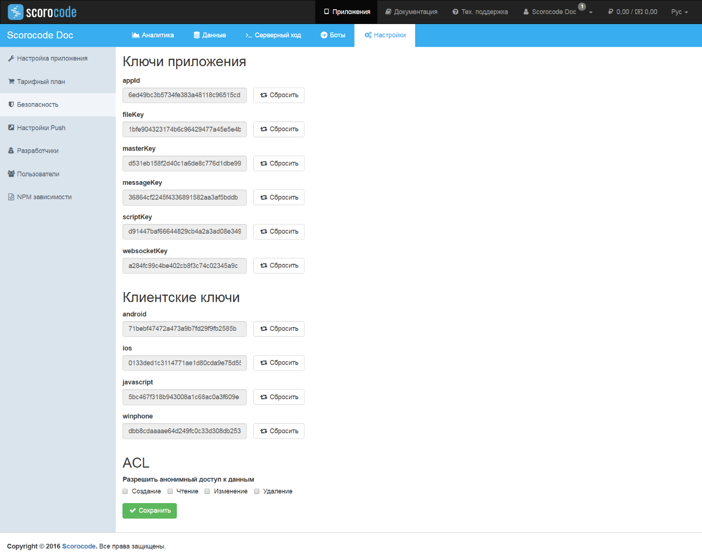
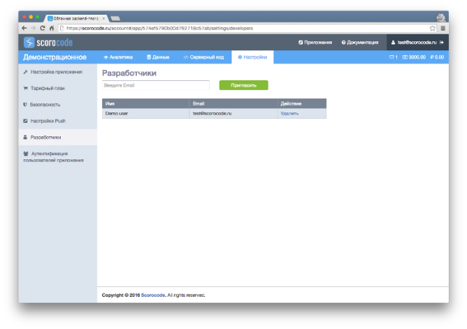
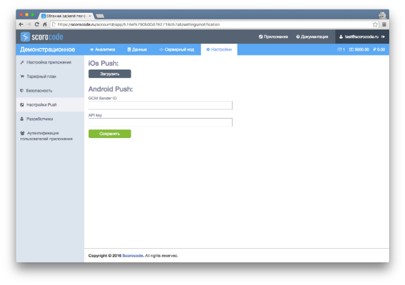
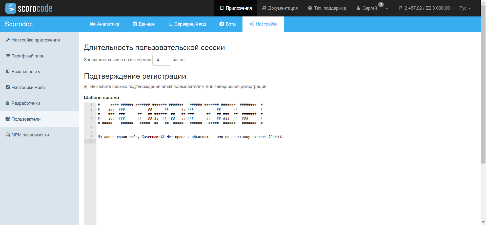

Для доступа к опциям настройки приложения перейдите на функциональную закладку «Настройки». На странице «Настройки» представлены следующие категории настроек:

* Настройка приложения;
* Тарифный план;
* Безопасность;
* Разработчики;
* Настройка Push;
* Аутентификация пользователей приложения.

## Тарифный план

Для настройки тарифного плана приложения перейдите по ссылке «Тарифный план». В открывшейся странице представлены сведения о текущим действующем тарифном плане и его активных опциях.

По умолчанию действует тарифный план FREE со следующими опциями:

* Запросов в секунду – 20;
* Хранилище – 10 Гб;
* Push уведомления – 500 000 (не более);
* Разработчиков – 1 (включая владельца приложения).

Для приобретения дополнительных опций необходимо перейти на тарифный план INDIE. Для смены тарифного плана перейдите по ссылке «Изменить» в строке с одноименным названием.

Во всплывающем окне укажите количество месяцев для приобретения тарифного плана INDIE (по умолчанию 1). Сервис выполнит расчет стоимости с учетом скидки (в случае её наличия). Скидка предоставляется при покупке тарифа/опции на срок от 12 месяцев. Для подтверждения покупки тарифного плана нажмите на кнопку «Приобрести».

Теперь можно выполнить покупку увеличения размера опции тарифного плана (при необходимости). Для этого перейдите по ссылке «Изменить» в строке с одноименным нужной опции, например «Хранилище».

Во всплывающем окне укажите количество месяцев для приобретения и количество дополнительного размера опции. Сервис выполнит расчет стоимости с учетом скидки. Для подтверждения покупки дополнительного размера опции тарифного плана нажмите на кнопку «Приобрести». В списке текущих активных опций будут отражены сведения о всех ваших покупках с указанием даты свершения и даты окончания действия настройки.

По истечении срока действия купленного тарифного плана и (или) опции осуществляется пересчет действующих ограничений с учетом значений дат окончания действия всех купленных дополнений по данному тарифному плану или опции.

По истечении срока действия всех купленных дополнений по опции устанавливается действие её значения по умолчанию.

По истечении срока действия тарифного плана INDIE устанавливается действие тарифного плана FREE, в том числе со значениями его опций.

## Безопасность

Для настройки ключей доступа к приложению и публичного доступа к данным приложения перейдите по ссылке «Безопасность».

На открывшейся странице представлены следующие ключи:

* appID – идентификатор приложения;
* android –  **клиентский ключ** платформы Android;
* javascript – **клиентский ключ** платформы JavaScript;
* iOs – **клиентский ключ** платформы iOs;
* winphone – **клиентский ключ** платформы winPhone;
* masterKey – мастер-ключ приложения для полного доступа через API;
* fileKey – ключ доступа к функциям API приложения (файлы);
* scriptKey – ключ доступа к функциям API приложения (скрипты);
* messageKey – ключ доступа к функциям API приложения (сообщения);
* webSocketKey - ключ доступа к функциям API приложения (websocket).

Кнопка «Сбросить» напротив каждого ключа сбрасывет его значение и генерирует новый ключ. Доступ к соответствующим функциям по старым ключам после этого становится невозможным.

Для разрешения или запрещение публичного (без авторизации) доступа к данным приложения установите опции ACL на чтение, запись, обновление и удаление.

## Разработчики

Добавление разработчиков, имеющих доступ к приложению осуществляется по ссылке «Разработчики».

Возможность добавления разработчиков приложения предоставляется в случае покупки соответствующего тарифного плана, т.е. если в тарифном плане выбрана опция с количеством разработчиков больше 1.

Введите адрес E-mail разработчика и нажмите на кнопку «Пригласить». Новому разработчику будет направлено приглашение на указанный адрес почты.

## Настройки Push

Данная категория настроек предназначена для настройки параметров, необходмых для отправки Push-уведомлений.

### iOS Push

Кнопка "Загрузить сертификат" позволяет загрузить в приложение файл сертификата, необходимый для отправки PUSH-уведомлений на устройства, работающие под управлением iOS.

[Подробнее]() о PUSH-уведомлениях Apple.

### Android PUSH

Поля "GCM Sender ID" и "API key" позволяют ввести данные, необходимые для отправки PUSH-уведомлений на устройства, работающие под управлением Android.

[Подробнее]() о PUSH-уведомлениях Android.

## Аутентификация пользователей приложения

Данный раздел настройки позволяет определить длительность пользовательской сессии.

Перейдите по ссылке «Аутентификация пользователей приложения». На открывшейся странице укажите времени в часах активности сессии работы с API после авторизации пользователя в приложении. По умолчанию длительность пользовательской сессии установлена в 72 часа.

Тут же можно указать необходимость направления письма подтверждения на адрес e-mail пользователя для завершения регистрации. В случае указания данной опции будет высылать письмо на указанный адрес пользователя после его регистрации через API c указанием ссылки на подтверждение для завершения регистрации. Текст шаблона письма для подтверждения регистрации задается в окне текстового редактора.

Для вставки ссылки на верификацию и имени пользователя необходимо в текст письма вставить следующие значения:

* `%link%` - ссылка на верификацию
* `%username%` - имя пользователя