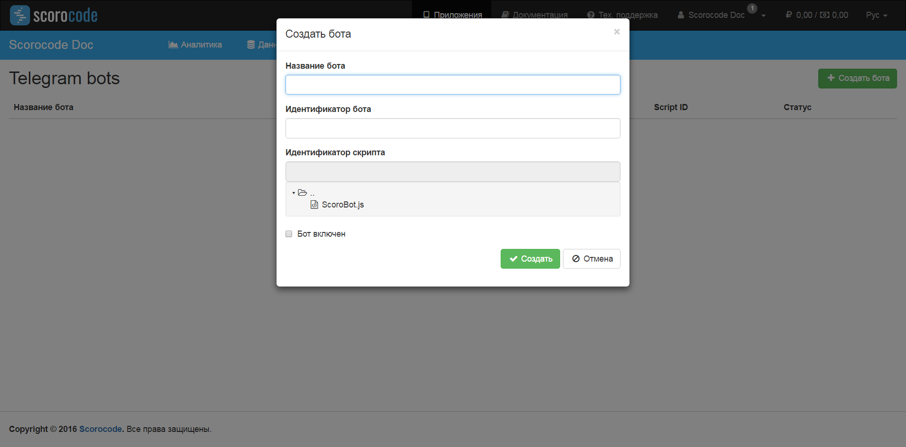

## Создание бота Telegram

Прежде чем начинать разработку, в качестве первого шага, бота необходимо зарегистрировать в Telegram и получить его уникальный id. Для этого в Telegram существует специальный бот — `@BotFather`. Отправьте ему команду `/newbot` — и бот просит придумать имя новому боту. Единственное ограничение на имя — в конце оно должно оканчиваться на «bot». В случае успеха `@BotFather` возвращает id бота.

Затем, в вашем приложении на Scorocode необходимо создать серверный скрипт, который будет привязан к боту и в котором будет происходить обработка событий.

Третьим шагом, необходимо создать бота в приложении. Для этого предейтите в раздел "Боты" и нажмите на кнопку "Создать бота". В открывшейся форме создания бота задайте слeдующие данные:

| Параметр      | Свойства | Описание |
| ------------- | -------- | -------- |
| Название бота | Обязательный | Название бота приложения |
| Идентификатор бота | Обязательный | Telegram id бота, полученный от '@BotFather' |
| Идентификатор скрипта | Обязательный | Выберите скрипт из списка серверных скриптов приложения |
| Флаг включения бота | Необязательный, по-умолчанию `false` | Флаг включения бота |

Для сохранения бота, нажмите кнопку "сохранить" и ваш бот появится в списке ботов приложения. Вы в любой момент можете отредактировать любые настройки бота, заданные при его создании, нажав на кнопку редактирования бота.  



## Принципы работы

При включении бота создается `webhook` на который приходят данные от `Telegram`. Эти данные доступны в серверном скрипте в объекте `pool` при каждом вызове. Полное описание полей доступно в [документации к Telegram Bot API](https://core.telegram.org/bots/api#getting-updates)

Ответные сообщения от бота передаются в объекте, имеющем следующую структуру:

```
{
    'method': 'sendMessage',                            // метод Telegram Bot API
    'method_params': {                                  // параметры для передачи в метод
      'chat_id': pool.message.chat.id.toString(),
      'text': 'Hello!',
      'reply_to_message_id': pool.message.message_id,
      'reply_markup': keyBoard
    },
  }
```

Полное описание поддерживаемых методов доступно в [документации к Telegram Bot API](https://core.telegram.org/bots/api#available-methods)

!!! Note "Поддерживаемые методы"
	Поддерживаеются все методы Telegram Bot API 2.3.1, за исключением Telegram Bot Games API

## Пример серверного скрипта Бота:

```js
var sc = require('scorocode');

var client = sc.Init({
  ApplicationID: "xxx", // <- заменить xxx на ключ appId приложения
  JavaScriptKey: "xxx", // <- заменить xxx на ключ javascript приложения
  MasterKey: "xxx" // <- заменить xxx на ключ masterKey приложения
});

var querystring = require('querystring');
var http = require('https');

function PostCode(post_data) {

  // An object of options to indicate where to post to
  var post_options = {
    host: 'bots.scorocode.ru',
    port: '443',
    path: '/bots/321196098:AAEDbOYD6iLWsHD7w28vqf3a9oBeJAPXXpg/response',
    method: 'POST',
    headers: {
      'Content-Type': 'application/json',
      'Content-Length': Buffer.byteLength(post_data)
    }
  };

  // Set up the request
  var post_req = http.request(post_options, function(res) {
    res.setEncoding('utf8');
    console.log(res.statusCode);
    res.on('data', function(chunk) {
      console.log('Response: ' + chunk);
    });
  });

  // post the data
  post_req.write(post_data);
  post_req.end();

}

// Crate new button for ReplyKeyboardMarkup
function newKeyboardButton(text, request_contact, request_location) {
  var button = {
    'text': text
  }

  if (request_contact) {
    button.request_contact = request_contact
  }

  if (request_location) {
    button.request_location = request_location
  }

  return button
}

// Main logic

const sourceMessage = pool.message.text.toLowerCase()
var request = null

if (sourceMessage === '/start' || sourceMessage === 'hello') {

  var keyBoard = {
    'keyboard': [
      [ newKeyboardButton('goodbye') ],
      [ newKeyboardButton('my phone number', true), newKeyboardButton('my location', null, true) ],
      [ newKeyboardButton('logo') ]
    ]
  }

  request = {
    'method': 'sendMessage',
    'method_params': {
      'chat_id': pool.message.chat.id.toString(),
      'text': 'Hello!',
      'reply_to_message_id': pool.message.message_id,
      'reply_markup': keyBoard
    },
  }


} else if (sourceMessage === 'logo') {

  request = {
    'method': 'sendPhoto',
    'method_params': {
      'chat_id': pool.message.chat.id.toString(),
      'photo': 'https://habrastorage.org/files/aab/c24/364/aabc24364c3b4e109c20ae71da646d91.jpg',
    },
  }

} else {
  return
}

PostCode(JSON.stringify(request));
```