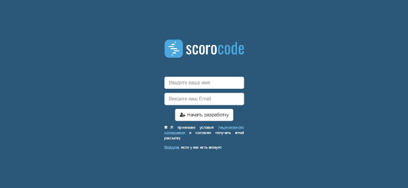

Для начала работы в scorocode требуется регистрация. На странице [регистрации](https://scorocode.ru/account#/signup) укажите свой адрес электронной почты и ваше имя.

После успешной регистрации вы перейдете в Личный кабинет разработчика, а на указанный адрес электронной почты будет направлено сообщение с указанием пароля для последующей авторизации. Изменить пароль, присвоенный системой, можно в разделе пользовательских настроек вашего личного кабинета.

Для входа в личный кабинет платформы, перейдите по ссылке «Войти», расположенной в основном меню Главной страницы. Введите указанные при регистрации логин (адрес E-mail) и пароль. В случае трехкратного неверного ввода пароля, система потребует ввести указанный на картинке текст (captcha). В случае, если вы забыли пароль, перейдите по ссылке «Забыли пароль?». В открывшемся окне восстановления пароля укажите ваш регистрационный Email, на который будет направлено информационное письмо со ссылкой для сброса пароля.