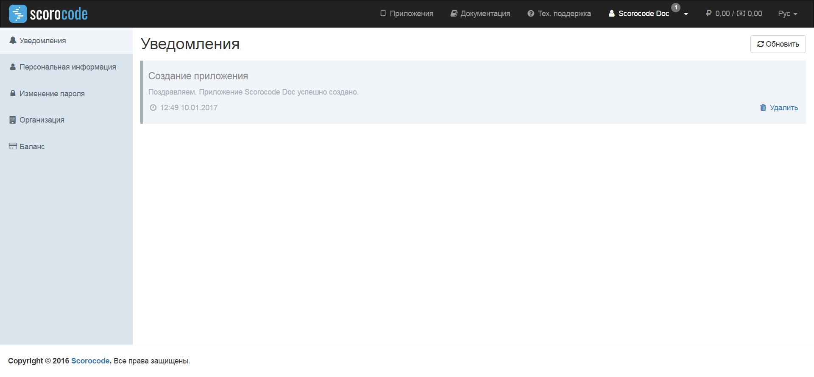
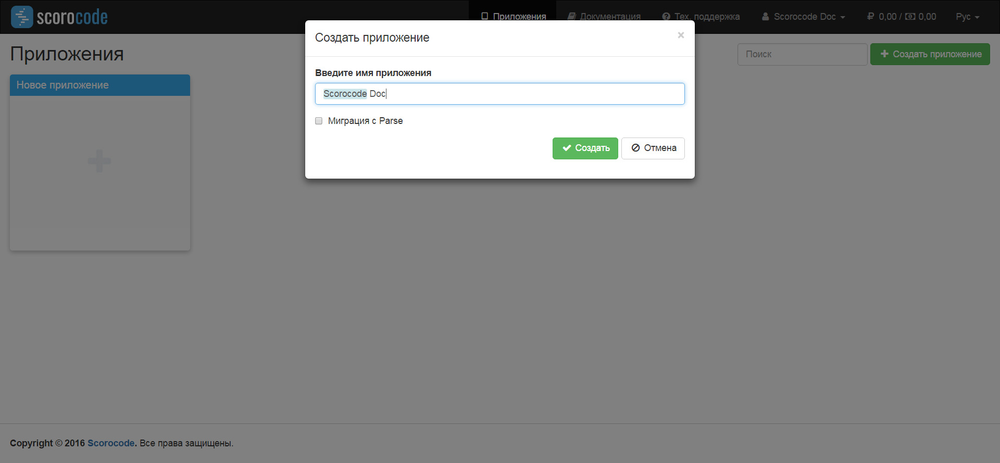
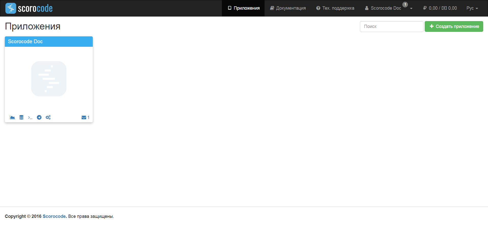

Личный кабинет разработчика включает разделы:

* пользовательские настройки и системные уведомления пользователю;
* приложения;
* документация

После авторизации вы попадаете на страницу «Приложения»

## Пользовательские настройки и системные уведомления пользователю

Для перехода в раздел пользовательских настроек и системных уведомлений нажмите на адрес электронной почты в названии своего личного кабинета. Страница пользовательских настроек и системных уведомлений включает разделы:

* Уведомления;
* Персональная информация;
* Изменение пароля;
* Организация;
* Баланс.

По умолчанию вы находитесь в разделе «Уведомления».

## Уведомления

В разделе «Уведомления» страницы «Пользовательские настройки и системные уведомления» вашего Личного кабинета представлен перечень направленных вам системных уведомлений. Для удаления системного уведомления воспользуйтесь ссылкой «Удалить».

## Персональная информация

В разделе персональная информация вы можете ввести (отредактировать) свои персональные данные: имя пользователя и номер телефона. Адрес электронный почты, используемый в качестве ваших учетных данных, не редактируется.

Для сохранения внесенных изменений нужно нажать на кнопку «Сохранить изменения».

## Изменение пароля

Для изменения своего пароля перейдите в раздел «Изменение пароля». Воспользуйтесь этой функцией для изменения пароля, сгенерированного системой при регистрации.

Длина нового пароля должна быть не менее 6 символов. Для сохранения вашего нового пароля нажмите на кнопку «Изменить пароль».

В разделе «Организация» вводятся данные о вашей организации. Данные информация используется для заключения договора, выставления счетов для оплаты по безналичному расчету и подготовки актов и других отчетных документов.

Для сохранения введенных данных нажмите на кнопку «Сохранить изменения».

## Баланс

В разделе «Баланс» представлена информация о вашем текущем балансе, а также детализация приходно-расходных операций.

В разделе «Баланс» вы можете пополнить ваш текущий баланс с использованием банковской карты. Для этого укажите сумму пополнения в рублях и нажмите на кнопку «Оплатить картой». Откроется окно с формой для заполнения реквизитов выполняемого платежа. Следуйте инструкциям платежного сервиса. Ваш текущий баланс может быть пополнен и по безналичному расчету, если заполнены реквизиты организации. Для формирования выписки с детализацией счета нажмите на ссылку «Экспорт».

## Приложения

Для перехода на страницу с приложениями нажмите на ссылку «Приложения», расположенную в верхнем меню Личного кабинете. Данная страница открыта по умолчанию после авторизации. На странице расположены виджеты, созданных ранее приложений, а также виджет для создания нового приложения.

Для создания нового приложения щелкните в области виджета «Новое приложение». Введите наименование создаваемого приложения в поле ввода и нажмите на кнопку «Создать». Наименование приложения может содержать любые символы.

Виджет с созданными ранее приложениями имеет название и меню с пиктограммами функций:

* Аналитика;
* Данные;
* Серверный код;
* Рассылки;
* Настройки.

Виджет с пустым приложением имеет наименование «Новое приложение» и не имеет функционального меню.

