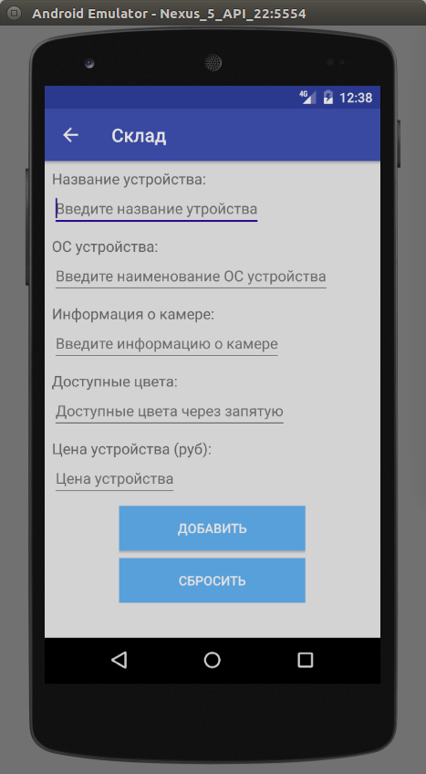
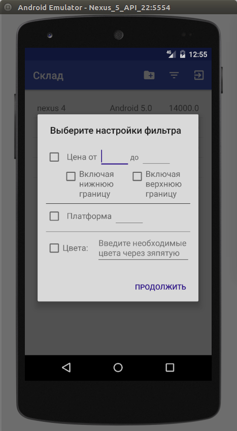
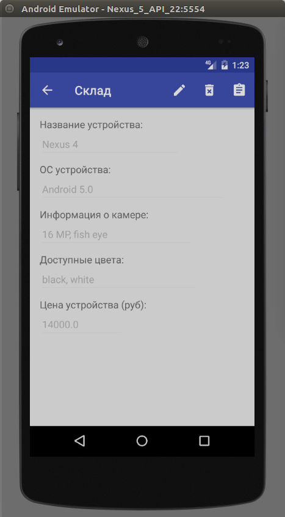
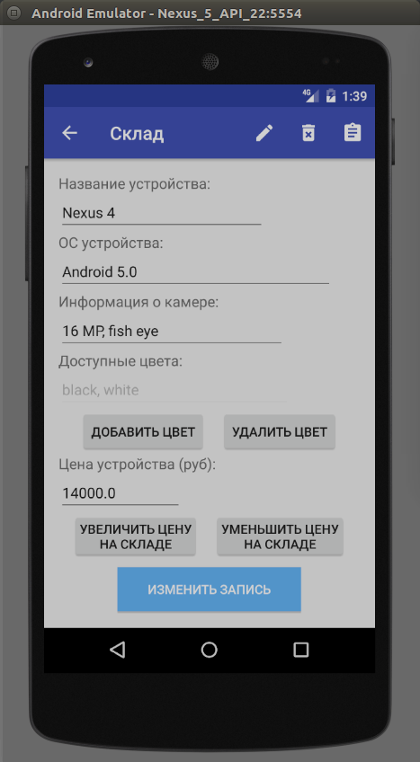

<a name="Storehouse"></a>
# Приложение "Склад"
Данная документация содержит описание демонстрационного приложения "Склад". Исходный код приложеия доступен в репозитории (https://github.com/PeterStaranchuk/Storehouse)
Данное приложение проводит учет мобильных телефонов на складе поставщика и позволяет:

1. Зарегистрировать нового пользователя в БД приложения
2. Провести аутентификацию пользователя приложения
3. Провести деаутентификацию пользователя приложения.
4. Посмотреть доступные модели телефонов на складе
5. Добавить модель телефона в БД
6. Удалить модель телефона из БД
7. Посмотреть подробную информацию о модели телефона
8. Изменить информацию о модели телефона
9. Выбрать интересующие модели из списка используя фильтр
10. Добавить пользователя в лист ожидания данной модели
11. Отгрузить данную модель телефона пользователю
12. Оповестить об отгрузке бухгалтерию при помощи email сообщения
13. Оповестить грузчика при помощи push сообщения.
14. Оповестить курьера при помощи sms сообщения.
15. Провести пересчет баланса фирмы с учетом отгруженных к данному моменту моделей.

## Стартовый экран приложения.
Стартовый экран приложения показан на рисунке 1.1. Ему соответствует класс <code>LoginActivity</code>.


Рисунок 1.1 – стартовый экран приложения.

В методе <code>onCreate</code> данного класса происходит инициализация <code>ScorocodeSdk</code> ключами <code>appId</code>, <code>clientKey</code> (android), <code>fileKey</code>, <code>messageKey</code>, <code>scriptKey</code> при помощи метода <code>ScorocodeSdk.initWith(...)</code>; Посмотреть данные ключи можно на вкладке «Безопасность» настроек проекта.

Листинг кода метода onCreate с инициализацией <code>ScorocodeSdk</code>.

```Java
@Override
protected void onCreate(Bundle savedInstanceState) {
    super.onCreate(savedInstanceState);
    setContentView(R.layout.activity_login);
    if (isUserLogined(this)) {
        MainActivity.display(this);
    }
    ScorocodeSdk.initWith(APPLICATION_ID, CLIENT_KEY, null, FILE_KEY, MESSAGE_KEY, SCRIPT_KEY, null);
    ButterKnife.bind(this);
}
```
На данном экране пользователь БД может ввести свой логин и пароль и системе. Приложения проведет проверку правильности введенных данных при помощи метода <code>.login()</code> класса <code>User</code>. Использование данного метода показано в листинге:

```Java
@OnClick(R.id.btnLogin)
public void onBtnLoginClicked() {
    User user = new User();
    user.login(etEmail.getText().toString(), etPassword.getText().toString(), new CallbackLoginUser() {
        @Override
        public void onLoginSucceed(ResponseLogin responseLogin) {
            DocumentInfo userInfo = responseLogin.getResult().getUserInfo();
            saveUserInfo(userInfo);
            MainActivity.display(LoginActivity.this);
        }
        @Override
        public void onLoginFailed(String errorCode, String errorMessage) {
            Helper.showToast(getBaseContext(), R.string.error_login);
        }
    });
}
```
В случае если в коллекции «users» имеется пользователь с указанными email и password, то будет выполнен метод <code>onLoginSucceed(...) callback</code> интерфейса иначе - <code>onFoginFailed(...)</code>. Таким образом мы можем удостовериться в наличии пользователя с такими данными в нашей БД и принять дальнейшие действия.

На стартовом экране (показанном на рисунке 1.1) так же имеется кнопка «Зарегистрировать» позволяющая зарегистрировать нового пользователя в системе (добавить его в коллекцию «users» БД). При нажатии на эту кнопку откроется экран, показанный на рисунке 1.2.


Рисунок 1.2 — экран регистрации нового пользователя.

На данном экране вводятся все необходимые поля документа (характеризующие пользователя). Регистрация нового пользователя происходит при помощи метода <code>.register</code> класса <code>User</code>. Пример использования данного метода:

```Java
@OnClick(R.id.btnRegister)
public void onBtnRegisterClicked() {
    String userName = etUsername.getText().toString();
    String email = etEmail.getText().toString();
    String password = etPassword.getText().toString();
    String passwordCheck = etPasswordCheck.getText().toString();

    if(isInputValid(userName, email, password, passwordCheck)) {
        new User().register(userName, email, password, new CallbackRegisterUser() {
            @Override
            public void onRegisterSucceed() {
                Toast.makeText(RegisterActivity.this, getResources().getString(R.string.register_succeed), Toast.LENGTH_SHORT).show();
                LoginActivity.display(RegisterActivity.this);
            }
            @Override
            public void onRegisterFailed(String errorCode, String errorMessage) {
                Toast.makeText(RegisterActivity.this, getResources().getString(R.string.error_register), Toast.LENGTH_SHORT).show();
            }
        });
    } else {
        Toast.makeText(this, getResources().getString(R.string.wrong_data) , Toast.LENGTH_SHORT).show();
    }
}
```

При успешной регистрации пользователя будет выполнен метод <code>onRegisterSucceed(...) callback</code> интерфейса иначе будет выполнен метод <code>onRegisterFailed(...)</code>.

## Главный экран приложения.
При вводе правильных данных email и password на стартовом экране пользователь попадает на главный экран приложения показанный на рисунке 2.1.


Рисунок 2.1 — главный экран приложения.

На данном экране показаны текущие модели телефонов, присутствующие на складе. В верхнем правом углу экрана показаны следующие иконки:

 - Добавить новую модель в базу данных.


 - Применить фильтр к списку устройств.

	   
 - Закончить активную сессию пользователя (logout).	


При нажатии на кнопку   пользователь переходит на экран добавления устройства в БД показанный на рисунке 2.2.


Рисунок 2.2 — Экран добавления нового устройства в БД.

На этом экране пользователь вводит всю необходимую информацию о устройстве и нажимает кнопку «ДОБАВИТЬ».
При этом программа создает новый документ, заполняет его поля и сохраняет на сервере. Данные действия показаны в листинге:

```Java
@OnClick(R.id.btnAddItem)
public void onBtnAddItemClicked() {
    Document document = new Document(MainActivity.COLLECTION_NAME);
    if (isAllFieldsFilled()) {
        document.setField(fields.getDeviceNameField(), getStringFrom(etDeviceName).trim());
        document.setField(fields.getPlatformField(), getStringFrom(etDevicePlatform).trim());
        document.setField(fields.getCameraInfoField(), getStringFrom(etDeviceCameraInfo).trim());
        document.setField(fields.getColorsAvailableField(), getColorsListFrom(getStringFrom(etDeviceColors)));
        document.setField(fields.getDevicePriceField(), Double.valueOf(getStringFrom(etDevicePrice)));
        document.saveDocument(new CallbackDocumentSaved() {
            @Override
            public void onDocumentSaved() {
                Toast.makeText(AddItemActivity.this, getString(R.string.succed_add_item), Toast.LENGTH_SHORT).show();
                finish();
            }

            @Override
            public void onDocumentSaveFailed(String errorCode, String errorMessage) {
                Toast.makeText(AddItemActivity.this, getString(R.string.error_add_item), Toast.LENGTH_SHORT).show();
            }
        });
    } else {
        Toast.makeText(this, getString(R.string.wrong_data), Toast.LENGTH_SHORT).show();
    }
}
```

В данном методе мы:

* Создаем новый документ коллекции (В нашем случае имя коллекции «storehouse» хранится в статической переменной <code>COLLECTION_NAME</code> класса <code>MainActivity</code>).
* Присваиваем его полям необходимые значения.
* Сохраняем документ.

В случае если мы создаем новый документ без ассоциации с документом в БД, т.е. без использования метода <code>.getDocumentById(…)</ccode>, то при сохранении программа вставляет новый документ в БД. Данные документы хранятся в БД Scorocode в виде показанном на рисунке 2.3


Рисунок 2.3 — храниение документов в коллекции БД Scorocode.

При нажатии на кнопку  пользователь попадает в диалоговое окно фильтра показанное на рисунке 2.4.


Рисунок 2.4 — диалоговое окно фильтра.

В данном диалоговом окне пользователь может задать условия выборки из БД по определенным критериям, а именно:
* Цена устройства
* Платформа устройства (Android или iOS, а так же номер версии ОС).
* Доступные в наличии цвета.

Листинг кода для задания фильтра:  

```Java
public void showFilterDialog(final CallbackFilterDialog callbackFilterDialog) {
    final View v = LayoutInflater.from(context).inflate(R.layout.filter_layout, null);
    final CheckBox cbPriceFilter = ButterKnife.findById(v, R.id.cbPriceFilter);
    final CheckBox cbPlatformFilter = ButterKnife.findById(v, R.id.cbPlatformFilter);
    final CheckBox cbColourFilter = ButterKnife.findById(v, R.id.cbColorFilter);
    final EditText etPlatformFilter = ButterKnife.findById(v, R.id.etPlatformFilter);
    final EditText etColors = ButterKnife.findById(v, R.id.etColors);
    
    AlertDialog.Builder builder = new AlertDialog.Builder(context)
            .setTitle(R.string.titleChooseFilterProperties)
            .setPositiveButton(R.string.continue_action, new DialogInterface.OnClickListener() {
                @Override
                public void onClick(DialogInterface dialog, int which) {
                    Query query = new Query(MainActivity.COLLECTION_NAME);
                    if (cbPriceFilter.isChecked()) {
                        setPriceFilter(v, query);
                    }
    
                    if (cbPlatformFilter.isChecked()) {
                        query.equalTo(new DocumentFields(context).getPlatformField(), etPlatformFilter.getText().toString());
                    }
    
                    if(cbColourFilter.isChecked()) {
                        List<Object> colors = new ArrayList<>();
                        colors.addAll(Arrays.asList(Helper.getStringFrom(etColors).split(",")));
                        query.containedIn(new DocumentFields(context).getColorsAvailableField(), colors);
                    }
                    query.findDocuments(new CallbackFindDocument() {
                        @Override
                        public void onDocumentFound(List<DocumentInfo> documentInfos) {
                             callbackFilterDialog.onFilterApplied(documentInfos);
                        }
                        @Override
                        public void onDocumentNotFound(String errorCode, String errorMessage) {
                            Helper.showToast(context, R.string.error);
                        }
                    });
                }
            }).setView(v);
    builder.show();
}

private void setPriceFilter(View view, Query query) {
    String priceField = new DocumentFields(view.getContext()).getDevicePriceField();
    final CheckBox cbIncludeLower = ButterKnife.findById(view, R.id.cbIncludeLower);
    final CheckBox cbIncludeUpper = ButterKnife.findById(view, R.id.cbIncludeUpper);
    final EditText etLowerPrice = ButterKnife.findById(view, R.id.etPriceFrom);
    final EditText etUpperPrice = ButterKnife.findById(view, R.id.etPriceTo);
    if(cbIncludeLower.isChecked()) {
        query.greaterThenOrEqualTo(priceField, getPrice(etLowerPrice));
    } else {
        query.greaterThan(priceField, getPrice(etLowerPrice));
    }
    if(cbIncludeUpper.isChecked()) {
        query.lessThanOrEqualTo(priceField, getPrice(etUpperPrice));
    } else {
        query.lessThan(priceField, getPrice(etUpperPrice));
    }
}
```

Фильтр задается следующим образом: мы создаем объект Query, выборку мы ведем из нашей коллекции. Далее: если выбран фильтр цены (установлена соответствующая галочка), то мы выбираем из БД только устройства для которых цена попадает в пределы указанных границ.

Границы цен задаются при помощи следующих методов:
* greaterThan задает нижнюю границу цены (не включая указанную цену).
* lessThan задает верхнюю границу цены (не включая указанную цену).
* greaterThanOrEqualTo задает нижнюю границу цены включая указанную цену.
* lessThanOrEqualTo задает верхнюю границу цены включая указанную цену.

Поиск по платформе задается при помощи метода <code>.equalTo(field, value)</code> класса <code>Query</code>.

Поиск по доступным цветам задается при помощи метода <code>.containedIn</code> класса <code>Query</code>.

Таким образом мы формируем запрос (query) для указанной коллекции БД и получаем экземпляры класса <code>DocumentInfo</code> характеризующие документы удовлетворяющие данному запросу. Эту информацию мы передаем в активность при помощи callback и обновляем там информацию.

При нажатии на кнопку  происходит завершение активной сессии пользователя (logout) и пользователь попадает обратно на страницу ввода Логина и пароля.

Для завершения активной сессии пользователя используется метода logout класса User.
Код использующий этот метод:

```Java
public static void logout(final Context context) {
    LocalPersistence.writeObjectToFile(context, null, LocalPersistence.FILE_USER_INFO);
    new User().logout(new CallbackLogoutUser() {
        @Override
        public void onLogoutSucceed() {
            display(context);
        }

        @Override
        public void onLogoutFailed(String errorCode, String errorMessage) {
            Helper.showToast(context, R.string.error);
        }
    });
}
```

В случае успешного завершения активной сессии пользователя будет вызван метод <code>onLogoutSucceed(...) callback</code> интерфейса, иначе будет вызван метод <code>onLogoutFailed(...)</code>.

# Экран подробной информации о устройстве.

При нажатии на любой из элементов списка устройств рисунка 2.1 пользователь попадает на экран подробной информации об устройстве показанный на рисунке 3.1


Рисунок 3.1 — экран подробной информации об устройстве.

В верхней правой части экрана присутствуют следующие иконки:

 Редактировать информацию о устройстве


 Удалить данное устройство из БД


 Перейти к информации об отгрузке данного товара.


При нажатии на кнопку  Редактировать информацию о устройстве экран переключается в режим редактирования показанный на рисунке 3.2.


Рисунок 3.2 — Экран подробной информации об устройстве в режиме редактирования

Для обновления информации об устройстве используется метод updateDocument() класса Document.
При этом новые значения следующих полей:
* Название устройства (поле deviceName в БД)
* ОС устройства (поле platform в БД)
* Информация о камере (deviceCameraInfo)

задаются при помощи метода set(field, value) класса Update.

Поле «доступные цвета» (поле colorsAvailable в БД) задается при помощи команд push (для добавления цвета устройства) и pull (для удаления цвета устройства).

Поле «цена устройства» (поле devicePrice в БД) задается при помощи метода inc(field, value) класса Update.
При этом если мы увеличиваем цену, то используем в положительные значения параметра value, если уменьшаем, то отрицательную.

Листинг кода обновления информации об устройстве:

```Java
private void updateItemDocument() {
    document.getDocumentById(getDocumentInfo().getId(), new CallbackGetDocumentById() {
        @Override
        public void onDocumentFound(DocumentInfo documentInfo) {
            document.updateDocument()
                    .set(fields.getDeviceNameField(), getStringFrom(etDeviceName))
                    .set(fields.getPlatformField(), getStringFrom(etDevicePlatform))
                    .set(fields.getCameraInfoField(), getStringFrom(etDeviceCameraInfo));
            setColorsUpdateInfo();
            document.updateDocument().inc(fields.getDevicePriceField(), increaseCount);
            document.saveDocument(new CallbackDocumentSaved() {
                @Override
                public void onDocumentSaved() {
                    setEditMode(false);
                    for (String color : deviceColors.keySet()) {
                        deviceColors.put(color, ColorState.FROM_DB);
                    }
                    document.updateDocument().getUpdateInfo().clear();
                }
                @Override
                public void onDocumentSaveFailed(String errorCode, String errorMessage) {
                    showToast(R.string.error_update_item);
                    setFields();
                }
            });
        }
        @Override
        public void onDocumentNotFound(String errorCode, String errorMessage) {
            showToast(R.string.error_update_item);
            setFields();
        }
    });
}

private void setColorsUpdateInfo() {
    for (String color : deviceColors.keySet()) {
        ColorState colorState = deviceColors.get(color);
        switch (colorState) {
            case TO_REMOVE:
                document.updateDocument().pull(fields.getColorsAvailableField(), color);
                break;
            case NEW:
                document.updateDocument().push(fields.getColorsAvailableField(), color);
                break;
        }
    }
}
```

Рассмотрим листинг подробней:
Для обновления полей документа нам нужно удостовериться, что такой документ существует и ассоциировать наш экземпляр класса Document с документом в БД. Для этого мы используем метод getDocumentById(…) класса Document.
После того как мы ассоциировали наш документ с документом из БД мы получаем объект класса Update при помощи метода updateDocument(). Далее используя объект класса Update мы задаем название, платформу и информацию о камере устройства при помощи метода set(…), добавляем (при помощи метода push) или удаляем (при помощи метода pull) в массив доступные цвета для данного устройства и изменяем цену (при помощи метода inc) в поле цены. После задания всех необходимых изменений в экземпляре класса Update мы производим сохранение документа при помощи метода saveDocument(…) класса Document.

Поскольку документ получен путем ассоциации с документом из БД (при помощи метода getDocumentById), то данный документ будет обновлен в коллекции (вместо загрузки нового документа).

 
Рассмотрим действие кнопки - при нажатии на данную кнопку происходит удаление информации о устройстве из БД. Для этого используется:

```Java
public static void fetchAndRemoveDocument(final Context context, final Document document, DocumentInfo documentInfo) {
    document.getDocumentById(documentInfo.getId(), new CallbackGetDocumentById() {
        @Override
        public void onDocumentFound(DocumentInfo documentInfo) {
            removeDocument(context, document);
        }
        @Override
        public void onDocumentNotFound(String errorCode, String errorMessage) {
            Helper.showToast(context, R.string.error_document_not_removed);
        }
    });
}
public static void removeDocument(final Context context, Document document) {
        document.removeDocument(new CallbackRemoveDocument() {
            @Override
            public void onRemoveSucceed(ResponseRemove responseRemove) {
                Toast.makeText(context, context.getString(R.string.document_removed), Toast.LENGTH_SHORT).show();
                ((Activity) context).finish();
            }
            @Override
            public void onRemoveFailed(String errorCode, String errorMessage) {
                Toast.makeText(context, context.getString(R.string.error_document_not_removed), Toast.LENGTH_SHORT).show();
            }
        });
}
```

Рассмотрим данный листинг подробней:
Сначала мы используем метод getDocumentById(...) класса Document для того чтобы удостовериться, что такой документ существует и провести ассоциацию данного документа с созданным нами экземпляром класса Document.

После того как мы удостоверились в наличии данного документа мы вызываем метод removeDocument класса Document который удаляет документ из БД.

Рассмотрим действие кнопки

При нажатии на эту кнопку мы переходим к экрану с информацией об отгрузке товара. Подробней о данном экране будет рассказано в части 4.

## Экран информации об отгрузке товара.

На рисунке 4.1 показан экран с подробной информацией об отгрузке товара.


Рисунок 4.1 — экран с информацией об отгрузке товара

При нажатии кнопки «ДОБАВИТЬ ПОКУПАТЕЛЯ» вызывается диалоговое окно с просьбой ввести информацию о покупателе после чего вызывается метод:

```Java
private void addBuyerAndRefreshWaitingList(final String buyerInfo) {
    if(!buyerInfo.trim().isEmpty()) {
        document.getDocumentById(getDocumentInfo().getId(), new CallbackGetDocumentById() {
            @Override
            public void onDocumentFound(DocumentInfo documentInfo) {
                document.updateDocument().push(fields.getBuyersField(), buyerInfo);
                document.saveDocument(new CallbackDocumentSaved() {
                    @Override
                    public void onDocumentSaved() {
                        document.updateDocument().getUpdateInfo().clear();
                        refreshWaitingList();
                        showToast(getBaseContext(), R.string.add_waiting_buyer);
                    }
                    @Override
                    public void onDocumentSaveFailed(String errorCode, String errorMessage) {
                        showToast(getBaseContext(), R.string.error);
                    }
                });
            }
            @Override
            public void onDocumentNotFound(String errorCode, String errorMessage) {
                showToast(getBaseContext(), R.string.error);
            }
        });
    }
}
```

Введенная пользователем информация о покупателе добавляется в конец массива покупателей с помощью метода push класса Update. Таким образом формируется очередь покупателей, ожидающих отправки товара.

При нажатии на кнопку «ОТГРУЗИТЬ ПОЛЬЗОВАТЕЛЮ» вызывается метод:

```Java
@OnClick(R.id.btnSendToUser)
public void onSendToUserButtonClicked() {
    document.getDocumentById(getDocumentInfo().getId(), new CallbackGetDocumentById() {
        @Override
        public void onDocumentFound(final DocumentInfo documentInfo) {
            document.updateDocument()
                    .popFirst(fields.getBuyersField())
                    .setCurrentDate(fields.getLastSendField());
   
         document.saveDocument(new CallbackDocumentSaved() {
                @Override
                public void onDocumentSaved() {
                    document.updateDocument().getUpdateInfo().clear();
                    new ItemNotificator(getBaseContext(), documentInfo.getId(), fields.getDeviceName()).notifyPersonalAboutItemSend();
                    new BalanceNotificator(getBaseContext()).refreshCompanyBalance();
                    etItemInfo.setVisibility(View.VISIBLE);
                    etItemInfo.append(fields.getLastSendTime());
                    refreshWaitingList();
                }
   
               @Override
                public void onDocumentSaveFailed(String errorCode, String errorMessage) {
                    showToast(getBaseContext(), R.string.error);
                }
            });
 }
```

В данном методе происходит ассоциация экземпляра класса Document с документом из БД при помощи метода getDocumentById() класса Document после чего получается экземпляр класса Update и используется его метод popFirst который удаляет первый элемент массива (имитируя обслуживание первого человека в очереди). Кроме того в поле «Последнее отгрузка совершена в» (поле lastSend в БД) записывается время последней отгрузки при помощи метода setCurrentDate(…) класса Update.

Так же на этом экране присутствует комментарий к отгрузке товара, который хранится в файле документа (поле sendInfo типа File). По умолчанию этот файл отсутствует и в текстовое окно выдается информацию по умолчанию «По товару в настоящее время нет комментария ...». Пользователь может нажать кнопку «редактировать», изменить комментарий к отгрузке и нажать «сохранить». При этом будет вызван метод:

```Java
public static void uploadFile(final Context context, Document document, String content) {
    document.uploadFile(new DocumentFields(context).getSendInfoField(), FILE_NAME, encode(content.getBytes()),
        new CallbackUploadFile() {
        @Override
        public void onDocumentUploaded() {
		//file loaded
	    }

        @Override
        public void onDocumentUploadFailed(String errorCode, String errorMessage) {
            Helper.showToast(context, R.string.error);
        }
    });
}
```

Данный метод загружает файл в поле (типа File) документа БД. Документ при этом должен быть ассоциирован при помощи метода getDocumentById(…). Аналогичным образом происходит удаление документа из БД.

При отгрузке товара пользователю так же вызывается метод notifyPersonalAboutItemSend() класса ItemNotificator. Данный метод проводит нотификацию персонала о том, что товар подготовлен к отправке:
* отсылает push сообщение грузчику
* отсылает sms сообщение курьеру
* отсылает email в бухгалтерию.

Листинг кода выполняющего эти операции:

```Java
public void notifyPersonalAboutItemSend() {
    sendPushToLoaderPerson();
    sendEmailInAccountingDepartment();
    sendSmsToDeliveryPerson();
}

private void sendSmsToDeliveryPerson() {
    Query query = new Query("roles");
    query.equalTo("name", "deliveryPerson");
    query.equalTo("isFree", true);
    query.setLimit(1);

    MessageSms messageSms = new MessageSms(context.getString(R.string.take_item) + getItemInfo());
    message.sendSms(messageSms, query, new CallbackSendSms() {
        @Override
        public void onSmsSended() {
            Helper.showToast(context, R.string.sms_was_sended);
        }

        @Override
        public void onSmsSendFailed(String errorCode, String errorMessage) {
            Helper.showToast(context, R.string.cant_send_sms);
        }
    });
}

private void sendEmailInAccountingDepartment() {
    Query query = new Query("roles");
    query.equalTo("name", "accountantPerson");

    MessageEmail messageEmail = new MessageEmail(context.getString(R.string.from), context.getString(R.string.device) + getItemInfo() , context.getString(R.string.device) + getItemInfo() + context.getString(R.string.sold));
    message.sendEmail(messageEmail, query, new CallbackSendEmail() {
        @Override
        public void onEmailSend() {
            Helper.showToast(context, R.string.email_was_sended);
        }
        @Override
        public void onEmailSendFailed(String errorCode, String errorMessage) {
            Helper.showToast(context, R.string.cant_send_email);
        }
    });
}

private void sendPushToLoaderPerson() {
    Query query = new Query("roles");
    query.equalTo("name", "loaderPerson");
    query.equalTo("isFree", true);
    query.setLimit(1);

    MessagePush messagePush = new MessagePush(context.getString(R.string.you_should_take) + getItemInfo() + context.getString(R.string.and_prepare), null);
    message.sendPush(messagePush, query, new CallbackSendPush() {
        @Override
        public void onPushSended() {
            Helper.showToast(context, R.string.push_sended);
        }
        @Override
        public void onPushSendFailed(String errorCode, String errorMessage) {
            Helper.showToast(context, R.string.cant_send_push);
        }
    });
}
```

Нотификация персонала действует следующим образом:

1. В методе sendEmailInAccountingDepartment из коллекции ролей («roles») выбирается роль «accountantPerson» и всем пользователям с такой ролью отсылаются email сообщения при помощи метода sendEmail класса Message.
2. В методе sendSmdToDeliveryPerson из коллекции ролей («roles») выбирается один (условие setLimit(1)) свободный (условие isFree == true) сотрудник с ролью «deliveryPerson» и ему отправляется sms при помощи метода sendSms класса Message.
3. В методе sendSmdToLoaderPerson из коллекции ролей («roles») выбирается один (условие setLimit(1)) свободный (условие isFree == true) сотрудник с ролью loaderPerson и ему отправляется push при помощи метода sendPush класса Message.

Кроме того после нажатия на кнопку «ОТГРУЗИТЬ ПОЛЬЗОВАТЕЛЮ» вызывается метод refreshCompanyBalance() класса BalanceNotivicator.

Листинг метода resreshCompanyBalance():

```Java
public void refreshCompanyBalance() {
    Script script = new Script();
    script.runScript(" 5800ad9342d52f1ba275fbcd", new CallbackSendScript() {
        @Override
        public void onScriptSended() {
            Helper.showToast(context, R.id.balance_refreshed);
        }
        @Override
        public void onScriptSendFailed(String errorCode, String errorMessage) {
            Helper.showToast(context, R.id.can_refresh_balance);
        }
    });
}
```

В данном листинге при помощи метода runScript(...) класса Script вызывается серверный код с id 5800ad9342d52f1ba275fbcd, который пересчитывает количество товаров на складе, издержки на хранение и другие характеристики.
 
